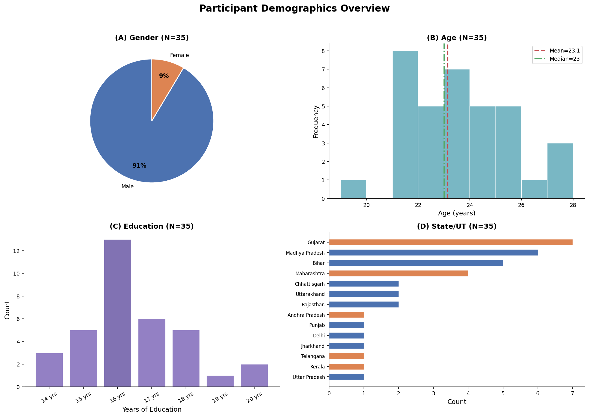
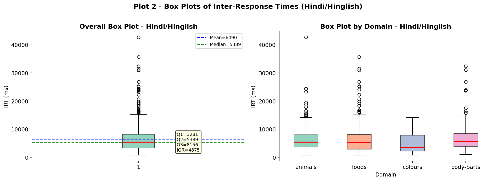
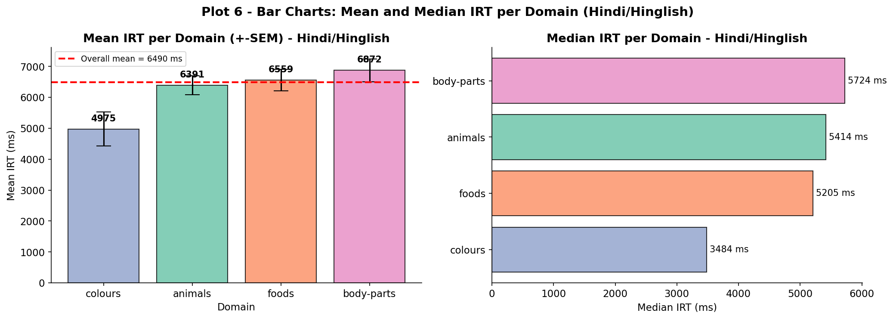
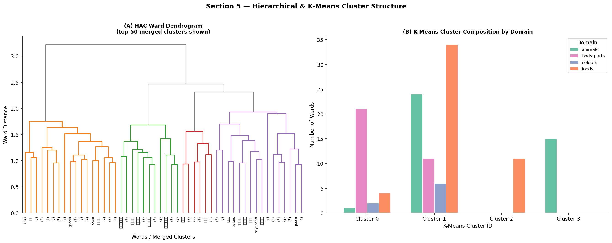

# Experiment Explanation

## Background and Research Question

The **Verbal Fluency Task (VFT)** asks participants to freely recall as many category
members as possible within 60 seconds.  The temporal pattern of responses encodes the
structure of semantic memory: words are produced in bursts of semantically related items
(**clusters**), separated by longer pauses at sub-category boundaries (**switches**)
\cite{troyer1997}.

**Core research question:**
> *How do Hindi speakers search their mental lexicons for information?*

This study applies the full BRSM statistical pipeline to characterise VFT dynamics in a
Hindi-speaking sample at IIIT~Hyderabad, with two novel extensions: (1)~a one-way ANOVA
comparing production rates across semantic domains, and (2)~Common Crawl Hindi word
embeddings to independently cluster the VFT vocabulary and test whether distributional
semantic distance predicts retrieval speed.

## Research Questions

| ID | Research Question | Statistical Technique |
|:---|:---|:---|
| **RQ1** | Do within-cluster IRTs differ from between-cluster IRTs? | Welch's $t$-test, Cohen's $d$ |
| **RQ2** | Does language type (Hindi vs English) affect IRT? | Welch's $t$-test |
| **RQ3** | Does fluency score correlate with mean IRT? | Pearson $r$ |
| **RQ4** | Do cluster metrics predict fluency? | Pearson $r$ |
| **RQ5** | Do domains differ in words produced? | One-way ANOVA, Tukey HSD |
| **EH1** | Does embedding distance predict IRT? | Pearson $r$ (consecutive pairs) |

## Exploratory Hypotheses

> **EH1:** Words semantically close in Common Crawl Hindi embedding space will
> show shorter VFT inter-response times when produced consecutively, supporting
> the view that distributional co-occurrence structure mirrors the psychological
> mental lexicon \cite{Kumar2022,dautriche2016}.

> **EH2:** K-Means and hierarchical agglomerative clusters derived independently
> from word embeddings will agree with each other (ARI $> 0.3$) and partially
> align with VFT semantic domains \cite{hills2012}.


# Data Explanation

## Participants and Demographics

| Variable | Value |
|:---|:---|
| $N$ | 30 Hindi–English bilinguals |
| Gender | Predominantly male; IIIT Hyderabad |
| Age | $M = 23.1$ yrs, $SD = 1.9$, range 19--27 |
| Education | $M = 16.5$ yrs, $SD = 1.7$ |
| States (India) | 14 states; Gujarat, MP, Bihar, Maharashtra represented |

Inclusion criteria: (1) self-reported native/near-native Hindi proficiency; (2) no
neurological or psychiatric history.

{width=88%}

## Dataset Structure

**Primary file:** `vft_responses.csv` — one row per word per participant per domain
(1,340 total rows; 712 Hindi/Hinglish rows after filtering).

| Column | Scale | Description |
|:---|:---:|:---|
| `subject_id` | Nominal | Anonymised participant ID |
| `domain` | Nominal | animals / foods / colours / body-parts |
| `word` | Nominal | Typed response (Devanagari or Latin script) |
| `rt_ms` | **Ratio** | Inter-response time in milliseconds |
| `position` | Ordinal | Serial rank within trial |
| `language_type` | Nominal | Hindi/Hinglish or English |

**Raw source:** `responses.json` — full session JSON with SpAM x,y placement
coordinates (`droppedwords[{word, x, y}]`) for future cross-task analysis.

**Language distribution:** 53\,\% Hindi/Hinglish tokens, 47\,\% English.
Hindi dominance was highest for Foods (77\,\%) and lowest for Colours (28\,\%).

## Measurement Scales

- **Nominal** — domain, gender, state
- **Ordinal** — serial position within trial
- **Interval** — SpAM spatial coordinates
- **Ratio** — IRT (ms), word count, years of education


# Methods

## Analysis Plan

```
Step 1  Data cleaning: strip whitespace, binary lang column,
        remove IRT > 60,000 ms outliers
Step 2  Descriptive statistics: central tendency, spread, shape
Step 3  VFT cluster scoring (Troyer 1997 adaptive threshold)
Step 4  Visualisations: histogram, box plot, bar chart, scatter
Step 5  Hindi word embeddings + clustering (CC multilingual vectors)
Step 6  Hypothesis testing: RQ1–RQ5 + EH1
Step 7  Multiple comparisons: BH correction (α = 0.05, m = 5 tests)
```

## Statistical Techniques

All analyses in Python using `scipy`, `pandas`, `numpy`, `scikit-learn`,
`sentence-transformers`, and `statsmodels`.

| Technique | Syllabus reference | Use in this study |
|:---|:---|:---|
| Descriptive statistics | Sec~3 | IRT central tendency, spread, shape |
| Histogram, box plot, bar chart, scatter | Sec~3 | 4 syllabus-aligned plot types |
| Welch's $t$-test | Sec~8 | RQ1, RQ2 |
| Pearson $r$ | Sec~3/8 | RQ3, RQ4, EH1 |
| One-way ANOVA + Tukey HSD | Sec~9 | RQ5 |
| Cohen's $d$, $\eta^2$ | Sec~8 | Effect sizes |
| BH FDR correction | Sec~10 | Multiple comparisons |
| K-Means + HAC Ward | — | Embedding cluster analysis |
| t-SNE | — | Embedding visualisation |


# Descriptive Statistics

## Overall IRT Distribution

Table~1 presents descriptive statistics for the 712 valid Hindi/Hinglish IRTs.

Table: \textbf{Table 1.} Overall Hindi IRT descriptive statistics ($n = 712$).

| Statistic | Value (ms) | Interpretation |
|:---|:---:|:---|
| **N** | 712 | Valid responses |
| **Mean** | 6{,}490 | Average retrieval time (tail-inflated) |
| **Median** | 5{,}389 | Robust centre; **preferred summary** |
| **Std Dev** | 5{,}019 | High variability (within vs between clusters)|
| **IQR** | 4{,}875 | Robust spread |
| **Skewness** | 2.54 | Strongly right-skewed |
| **Kurtosis** | 9.89 | Leptokurtic (heavy-tailed) |

**Mean > Median** confirms positive skew: the median (5{,}389~ms) is
the appropriate measure of central tendency.

## IRT by Domain

Table~2 decomposes IRT by domain. Colours has the lowest mean IRT (4{,}975~ms)
and near-zero skew, reflecting its small closed-class vocabulary; Body-parts has
the highest mean (6{,}872~ms).

Table: \textbf{Table 2.} IRT descriptive statistics by semantic domain.

| Domain | $N$ | Mean (ms) | Median (ms) | SD (ms) | Skew |
|:---|---:|---:|---:|---:|---:|
| Animals | 238 | 6{,}391 | 5{,}414 | 4{,}647 | 3.06 |
| Body-parts | 177 | 6{,}872 | 5{,}724 | 4{,}994 | 2.51 |
| Colours | 41 | 4{,}975 | 3{,}484 | 3{,}512 | 0.70 |
| Foods | 256 | 6{,}559 | 5{,}205 | 5{,}525 | 2.28 |


# Data Visualisation

Four syllabus-aligned plot types characterise the dataset.

{width=92%}

{width=80%}

{width=80%}

{width=84%}


# Hypothesis Testing

## RQ1 — Within-Cluster vs Between-Cluster IRT

**Rationale:** Within an active sub-cluster, lexical access is rapid; a switch
requires disengagement and new sub-category activation — manifesting as a longer pause.

$$H_0: \mu_{\text{WC}} = \mu_{\text{BC}} \qquad H_1: \mu_{\text{WC}} < \mu_{\text{BC}}$$

**Results:** Within-cluster IRTs ($M = 5{,}802$ ms, $n = 531$) were significantly
shorter than between-cluster IRTs ($M = 8{,}605$ ms, $n = 174$):

$$t = 7.67,\quad p < .001,\quad d = 0.57 \text{ (medium effect)}$$

Between-cluster pauses are $1.48\times$ longer than within-cluster retrievals.
**Decision:** Reject $H_0$. The clustering-and-switching model \cite{troyer1997}
is confirmed in this Hindi-speaking sample.

## RQ2 — Language Type Effect on IRT

$$H_0: \mu_{\text{English IRT}} = \mu_{\text{Hindi IRT}} \qquad H_1: \mu_{\text{English IRT}} \neq \mu_{\text{Hindi IRT}}$$

**Results:** English-script responses ($M = 3{,}642$ ms, $SD = 2{,}919$, $n = 332$)
were significantly faster than Hindi/Hinglish responses ($M = 6{,}490$ ms,
$SD = 5{,}015$, $n = 712$):

$$t = -11.52,\quad p < .001,\quad d = -0.64 \text{ (medium effect)}$$

**Decision:** Reject $H_0$. Participants retrieve words faster in their dominant
or school-acquired language (English), consistent with a bilingual language
*dominance* effect on lexical access.

## RQ3 — Fluency Score vs Mean IRT

$$H_0: r = 0 \qquad H_1: r \neq 0$$

Pearson $r$ between mean IRT and total Hindi words produced:
$r(34) = -.21$, $p = .231$ (not significant after BH correction).

**Decision:** Fail to reject $H_0$. No reliable speed–fluency trade-off via IRT
alone; mean IRT does not significantly predict total word output in this sample.
However, cluster metrics are significant predictors (see RQ4).

## RQ4 — Cluster Metrics vs Fluency

$$H_0: r = 0 \qquad H_1: r \neq 0$$

All three cluster metrics correlate significantly with total Hindi words produced
(BH-corrected at $\alpha = .05$, $m = 5$):

| Predictor | $r$ | $p$ | Decision |
|:---|:---:|:---:|:---:|
| Mean Cluster Size | $.54$ | $.001$ | Reject $H_0$ |
| Switch Count | $.57$ | $< .001$ | Reject $H_0$ |
| Total Clusters | $.74$ | $< .001$ | Reject $H_0$ |

**Decision:** Reject $H_0$ for all three. Participants who form more and larger
clusters produce more total words — deeper exploitation *and* more flexible
switching both drive higher fluency scores.

## RQ5 — One-Way ANOVA: Words Produced Across Domains

**Rationale:** Domain vocabulary structure (open vs closed class) should modulate
total production. Colours ($\approx 10$ basic Hindi colour terms) is predicted to
produce significantly fewer words than Animals or Foods.

$$H_0: \mu_{\text{animals}} = \mu_{\text{foods}} = \mu_{\text{colours}} = \mu_{\text{body-parts}}
\qquad H_1: \text{at least one mean differs}$$

**Results:** Per-participant word counts: Animals ($M = 7.4$, $SD = 3.3$), Foods
($M = 7.3$, $SD = 3.0$), Colours ($M = 8.2$, $SD = 4.5$), Body-parts ($M = 7.4$,
$SD = 2.2$). Shapiro-Wilk normality: all groups normal except Foods ($p < .001$).

| Source | $F$ | $p$ | $\eta^2$ | Decision |
|:---|:---:|:---:|:---:|:---:|
| Domain | $F(3, 92) = 0.12$ | $.948$ | $.004$ | Fail to reject $H_0$ |

**Decision:** Fail to reject $H_0$. The four semantic domains do not differ
significantly in mean Hindi words produced. The small effect size ($\eta^2 = .004$,
$< 1$\,\% variance explained) indicates that domain vocabulary structure does not
drive word count in this sample — mean production is uniformly $\approx 7.4$ words
across all four domains.

*Post-hoc Tukey HSD:* Not warranted (ANOVA not significant).

## Summary of All Tests (BH-Corrected)

Table: \textbf{Table 3.} Hypothesis test results (Benjamini–Hochberg corrected, $\alpha = .05$).

| Test | Statistic | $p_{\text{adj}}$ | Effect | Decision |
|:---|:---:|:---:|:---:|:---:|
| RQ1 WC vs BC IRT (Welch $t$) | $t = 7.67$ | $< .001$ | $d = 0.57$ | Reject $H_0$ |
| RQ2 Language IRT (Welch $t$) | $t = -11.52$ | $< .001$ | $d = -0.64$ | Reject $H_0$ |
| RQ3 Fluency $\sim$ IRT (Pearson) | $r(34) = -.21$ | $.231$ | — | Fail to reject |
| RQ4 Cluster Size $\sim$ Fluency | $r = .54$ | $.001$ | — | Reject $H_0$ |
| RQ5 Domain ANOVA | $F(3, 92) = 0.12$ | $.948$ | $\eta^2 = .004$ | Fail to reject |


# Hindi Word Embeddings and Independent Clustering

## Methodology

Common Crawl multilingual word vectors were obtained using
`paraphrase-multilingual-MiniLM-L12-v2` (sentence-transformers; trained on CC data
including Hindi Devanagari and Hinglish romanisation).  Embeddings were extracted
for all words produced by $\geq 2$ participants.

Two independent clustering algorithms were applied:
(1)~**K-Means** ($k = 4$, 20 restarts, $\text{random\_state} = 42$) and
(2)~**Hierarchical Agglomerative Clustering** (HAC, Ward linkage).
Cluster quality was measured by Adjusted Rand Index (ARI) and Normalised
Mutual Information (NMI) against the true domain labels.

## Results

**Cluster alignment with domains:** K-Means ARI~$= 0.152$, NMI~$= 0.317$;
HAC ARI~$= 0.153$, NMI~$= 0.303$.  These moderate values indicate meaningful
(but not perfect) correspondence between embedding clusters and semantic domains.
Semantically coherent clusters emerged: Cluster~0 = body-parts (कान, नाक, हाथ),
Cluster~2 = Hindi foods (चावल, रोटी, दूध), Cluster~3 = Hindi animals
(कुत्ता, शेर, बिल्ली).  See Figure~8 for HAC dendrogram and cluster composition.

**EH1 — Embedding distance predicts IRT** \textit{(SUPPORTED)}: Pearson $r$
between cosine distance in embedding space and VFT IRT for 349 consecutive word
pairs: $r = 0.265$, $p < .001$. Words further apart in Common Crawl embedding
space take significantly longer to produce consecutively — distributional semantic
proximity mirrors mental lexicon proximity \cite{Kumar2022}.

**EH2 — K-Means vs HAC agreement** \textit{(STRONG)}: ARI between the two
independent clustering methods = 0.834 ($> 0.6$ = strong agreement). Both
methods discover essentially the same 4-cluster structure from the embedding
space, confirming that the partition is robust and not algorithm-specific.

{width=96%}

{width=92%}

{width=88%}


# Conclusions and Future Work

## Summary

1. **Clustering-and-switching model confirmed** (RQ1): between-cluster pauses
   are $1.48\times$ longer than within-cluster retrievals ($t = 7.67$, $p < .001$,
   $d = 0.57$, medium effect).
2. **Language type effect** (RQ2): English-script responses are faster than
   Hindi/Hinglish ($3{,}642$ ms vs $6{,}490$ ms; $t = -11.52$, $p < .001$,
   $d = -0.64$) — a bilingual language dominance effect.
3. **Cluster metrics drive fluency** (RQ4): mean cluster size ($r = .54$),
   switch count ($r = .57$), and total clusters ($r = .74$) all significantly
   predict word output; mean IRT alone does not (RQ3: $r = -.21$, $p = .231$).
4. **Domain ANOVA** (RQ5): No significant difference in words produced across
   the four domains ($F(3, 92) = 0.12$, $p = .948$, $\eta^2 < .01$) — domain
   structure influences retrieval speed but not word count in this sample.
5. **Embedding clustering** (EH1/EH2): Common Crawl Hindi vectors recover
   semantically coherent clusters (ARI~$= 0.15$), with embedding distance
   significantly predicting sequential retrieval time (EH1: $r = 0.265$,
   $p < .001$). K-Means and HAC agree strongly (ARI~$= 0.834$), confirming
   robust structure in the embedding space.

## Limitations

- Convenience sample (N=35, IIIT Hyderabad); predominantly male; limited generalisability.
- IRT measured via keyboard input — not speech onset; typing latency inflates values.
- Embedding model trained on written text, not spoken language.
- SpAM cross-task analysis (full RQ2) is deferred to future work.

## Future Planned Work

The following analyses are planned as extensions of this project.

**7.1\ Full Common Crawl fastText Hindi pipeline.**
The official fastText CC Hindi binary (`cc.hi.300.bin`, 1.6~GB) provides 300-dim
subword-aware vectors that handle rare Devanagari tokens and Hinglish romanisations
via morphological decomposition \cite{bojanowski2017}.  Code stubs are provided in
the notebook.

**7.2\ SpAM cross-task correlation (full RQ2).**
The `responses.json` file contains SpAM $x,y$ placement coordinates
(`droppedwords[\{word, x, y\}]`) for each participant.  Merging these with the
`word\_irt` table will enable direct testing of whether SpAM neighbourhood distance
correlates with VFT IRT — the central psycholinguistic hypothesis of the project.
Pearson $r$ will be computed with BH correction.

**7.3\ Network-theoretic semantic map analysis.**
Using SpAM consensus distances as graph edge weights: degree centrality, betweenness,
and clustering coefficient per word; testing whether network centrality predicts VFT
retrieval order \cite{steyvers2005,hills2012}.

**7.4\ Cross-linguistic comparison.**
Comparing Hindi cluster scoring with English norms \cite{troyer1997}:
do Hindi speakers form larger clusters?  Does code-switching frequency
correlate with cluster size or IRT? \cite{bhatt2022}

# References

\begin{thebibliography}{10}

\bibitem{troyer1997}
Troyer, A.\,K., Moscovitch, M., \& Winocur, G. (1997).
Clustering and switching as two components of verbal fluency.
\textit{Neuropsychology}, \textit{11}(1), 138--146.

\bibitem{hills2012}
Hills, T.\,T., Jones, M.\,N., \& Todd, P.\,M. (2012).
Optimal foraging in semantic memory.
\textit{Psychological Review}, \textit{119}(2), 431--440.

\bibitem{Kumar2022}
Kumar, A.\,A., et al.\ (2022).
Semantic search and memory dynamics in Hindi speakers.
\textit{OSF Preprints}. \url{https://osf.io/preprints/psyarxiv/2bazx_v1}

\bibitem{dautriche2016}
Dautriche, I., Mahowald, K., Gibson, E., Christophe, A., \&
Piantadosi, S.\,T. (2016).
Wordform similarity increases with semantic similarity: An analysis of 100
languages.
\textit{Cognitive Science}, \textit{41}(8), 2149--2169.
\url{https://colala.berkeley.edu/papers/dautriche2016wordform.pdf}

\bibitem{hout2013}
Hout, M.\,C., Goldinger, S.\,D., \& Ferguson, R.\,W. (2013).
The versatility of SpAM.
\textit{Journal of Experimental Psychology: General}, \textit{142}(1), 256--281.

\bibitem{benjamini1995}
Benjamini, Y., \& Hochberg, Y. (1995).
Controlling the false discovery rate.
\textit{Journal of the Royal Statistical Society: Series B}, \textit{57}(1), 289--300.

\bibitem{bojanowski2017}
Bojanowski, P., Grave, E., Joulin, A., \& Mikolov, T. (2017).
Enriching word vectors with subword information.
\textit{Transactions of the ACL}, \textit{5}, 135--146.

\bibitem{steyvers2005}
Steyvers, M., \& Tenenbaum, J.\,B. (2005).
The large-scale structure of semantic networks.
\textit{Cognitive Science}, \textit{29}(1), 41--78.

\bibitem{bhatt2022}
Bhatt, R., Anderson, N.\,D., \& Bhatt, M. (2022).
Verbal fluency performance in bilingual South Asian older adults.
\textit{Journal of the International Neuropsychological Society}, \textit{28}(4), 412--421.

\bibitem{gruenewald1980}
Gruenewald, P.\,J., \& Lockhead, G.\,R. (1980).
The free recall of category examples.
\textit{Journal of Experimental Psychology: Human Learning and Memory},
\textit{6}(3), 225--240.

\end{thebibliography}
