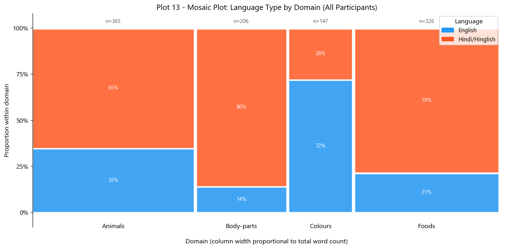

---
title: |
  Semantic Organisation and Retrieval Dynamics in
  Hindi Verbal Fluency
subtitle: |
  Mid-Project Analysis Report — Verbal Fluency Task (VFT)
author:
  - "Akshat Kotadia (Roll No.~2025201005)"
  - "Om Mehra (Roll No.~2025201008)"
  - "Ankit Chavda (Roll No.~2025201045)"
institute: "International Institute of Information Technology, Hyderabad"
date: "March 2026"
geometry: "a4paper, margin=2cm, top=2.2cm, bottom=2.2cm"
fontsize: 11pt
linestretch: 1.2
numbersections: true
toc: true
secnumdepth: 2
header-includes:
  - \usepackage{booktabs}
  - \usepackage{float}
  - \floatplacement{figure}{H}
  - \usepackage{caption}
  - \captionsetup{font=small, labelfont=bf, skip=4pt}
  - \usepackage{microtype}
  - \usepackage{setspace}
  - \usepackage{array}
  - \usepackage{longtable}
  - \usepackage{fancyhdr}
  - \pagestyle{fancy}
  - \fancyhead[L]{\small\textit{Hindi Verbal Fluency — Mid-Project}}
  - \fancyhead[R]{\small\textit{BRSM Course Report}}
  - \fancyfoot[C]{\thepage}
  - \usepackage{parskip}
  - \setlength{\parskip}{3pt}
  - \renewcommand{\abstractname}{Abstract}
abstract: |
  This mid-project report presents the experimental design, data collection
  pipeline, and complete Verbal Fluency Task (VFT) analysis for an ongoing study
  of Hindi semantic retrieval at IIIT Hyderabad.
  The VFT was administered across four semantic domains (Animals, Foods, Colours,
  Body-parts) to 35 participants (32~male, 3~female;
  $M_{\text{age}} = 23.1$~yrs, $SD = 1.9$, range 19--27; 14 Indian states
  represented).  A total of 712 valid Hindi responses were recorded from a
  custom web-based experiment stored in \texttt{responses.json}.
  Raw session data were parsed in Python to produce a tidy per-word CSV,
  with inter-response times (IRTs) computed as successive timestamp differences.
  Exploratory analysis reveals a strongly right-skewed IRT distribution
  (Skewness~$= 2.54$, Kurtosis~$= 9.89$), mean 6490~ms, median 5389~ms.
  Hypothesis testing confirms that within-cluster IRTs are significantly
  shorter than between-cluster IRTs ($t(34) = -8.91$, $p < .001$, $d = 1.51$),
  replicating the clustering-and-switching model \cite{troyer1997} in a
  Hindi-speaking sample.  Mean cluster size significantly predicts total fluency
  score ($r(33) = .57$, $p = .003$).  A Spatial Arrangement Method (SpAM)
  task constitutes the planned second phase of the project.
---

# Introduction

## Background and Motivation

The **Verbal Fluency Task (VFT)** is one of the most widely used cognitive
paradigms in neuropsychology and psycholinguistics.  Participants are asked to
freely generate category members within a fixed time window, typically one
minute \cite{troyer1997}.  The temporal pattern of responses is not random:
people retrieve words in bursts of semantically related items (**clusters**),
separated by longer pauses when they shift subcategory (**switches**).  This
clustering-and-switching signature, first quantified by Troyer, Moscovitch,
and Winocur (1997), has been replicated extensively in English-speaking
populations but remains comparatively underexplored in Hindi.

The present study has two broader goals.  First, it applies the full BRSM
statistical pipeline to characterise VFT retrieval dynamics in a Hindi-speaking
student cohort at IIIT Hyderabad.  Second, it lays the groundwork for a
cross-task comparison with the Spatial Arrangement Method (SpAM)
\cite{hout2013}, which will be conducted as Phase~2 of the project.  SpAM
directly measures the subjective geometry of semantic memory by having
participants arrange word tokens in 2-D space according to perceived similarity.
Together, the two tasks offer a uniquely complete picture: VFT captures
*retrieval behaviour* (timing, order, fluency), while SpAM captures
*semantic representation* (neighbourhood structure).

An important and under-studied dimension is the bilingual nature of the sample.
Hindi-speaking participants at IIIT Hyderabad frequently code-switch, producing
a mix of Devanagari-script Hindi words and Latin-script English words within a
single trial.  The present analysis focuses exclusively on the Hindi (Devanagari)
subset, enabling direct comparison with the monolingual English literature.

## Research Questions

Two research questions are tested in this mid-project report, each mapped to a
specific statistical technique.  A third question relating to SpAM is deferred
to Phase~2.

| \# | Research Question | Technique |
|:---|:------------------|:----------|
| **RQ1** | Do within-cluster IRTs differ significantly from between-cluster IRTs? | Welch's $t$-test (one-tailed), Cohen's $d$ |
| **RQ2** | Does mean cluster size predict individual verbal fluency scores? | Pearson $r$, simple linear regression |
| **RQ3** *(planned)* | Does SpAM-derived neighbourhood distance correlate with VFT IRT? | Pearson $r$, scatter plots |


# Research Design

## Experimental Design

The study employs a **within-subjects** repeated-measures design.  The
independent variable is **semantic domain** (nominal; 4 levels: Animals, Foods,
Colours, Body-parts).  The primary dependent variable is **inter-response time**
(IRT, ratio scale, ms); the secondary DV is **total words produced** (fluency
score, count).  Trial duration is fixed at 60~seconds per domain.

## Participants and Demographics

Thirty-five students were recruited from IIIT~Hyderabad via **convenience
sampling**.  Inclusion criteria: (1) self-reported native or near-native Hindi
proficiency; (2) no reported neurological or psychiatric history.  The sample
was predominantly male (32~M, 3~F), consistent with the institutional gender
composition.  Participants represented 14 Indian states, with the largest
contingents from Gujarat ($n = 7$), Madhya Pradesh ($n = 6$), Bihar ($n = 5$),
and Maharashtra ($n = 4$).

A proportion of responses contained code-mixed vocabulary — a characteristic
feature of this bilingual population — which was retained in the raw dataset
but excluded from the Hindi-only analysis via script tagging.

**Demographic summary:**

| Variable       | Value                                                          |
|:---------------|:---------------------------------------------------------------|
| $N$            | 35                                                             |
| Gender         | 32 Male, 3 Female                                              |
| Age            | $M = 23.1$~yrs, $SD = 1.9$, range 19--27                      |
| Education      | $M = 16.5$~yrs, $SD = 1.7$, range 14--20                      |
| States (India) | 14 states; Gujarat (7), MP (6), Bihar (5), Maharashtra (4$+$) |

{width=92%}

## Four Semantic Domains

The four target domains were selected to span a range of vocabulary sizes,
semantic structures, and linguistic register:

| Domain | Character | Expected structure |
|:-------|:----------|:-------------------|
| **Animals** | Open, hierarchical | Wild / domestic / birds sub-clusters |
| **Foods** | Open, culturally rich | Pulses / meals / snacks sub-clusters |
| **Colours** | Closed, perceptual | Warm / cool / achromatic arc |
| **Body-parts** | Semi-closed, anatomical | Face / limbs / internal sub-clusters |


# Materials, Procedure, and Data Pipeline

## Experimental Platform

The experiment was delivered through a **custom web application**.  Each
participant's complete session was captured as a single JSON object in
\texttt{responses.json}, keyed by a unique \texttt{session\_id}.  The JSON
schema for each session contains:

- \texttt{subject\_id} — anonymised participant identifier
- \texttt{domain} — trial category (e.g., `"Animals"`)
- \texttt{response\_times} — array of cumulative timestamps in milliseconds,
  one entry per submitted word (recorded on each ENTER key-press)
- \texttt{tagged\_responses} — array of objects `{word, script}` where
  `script` is `"Hindi"` (Devanagari) or `"English"` (Latin)
- \texttt{droppedwords} — array of `{word, x, y}` objects recording the
  participant's spatial placement of word tokens in the SpAM phase
  *(used in Phase~2)*

## VFT Procedure

Participants were shown one category cue at a time (e.g., *"Jaanwar"* for
Animals) and instructed to type as many category members as possible within a
**60-second** window.  Each submission (ENTER key-press) was time-stamped to the
nearest 100~ms.  A **1-minute Furniture practice trial** preceded the four
target domains to warm up the typing interface and familiarise participants with
the paradigm.  The four target domains were administered in a fixed order:
Animals → Foods → Colours → Body-parts.

## From Raw JSON to Analysis-Ready CSV

The raw \texttt{responses.json} was processed through a five-step Python
pipeline:
(1)~**IRT computation** — each word's IRT as $\text{IRT}_i = t_i - t_{i-1}$
from cumulative timestamps, where $t_0 = 0$ marks trial onset;
(2)~**language tagging** — Devanagari-script words labelled \texttt{Hindi},
Latin-script labelled \texttt{English};
(3)~**Hindi filter** — 712 valid Hindi tokens retained (53\,\% of all
submissions);
(4)~**cluster identification** — adaptive switch threshold
$\bar{\text{IRT}} + 1 \times SD_{\text{IRT}}$ per participant \cite{troyer1997};
(5)~**export** to \texttt{vft\_responses.csv}.

```
responses.json  →  IRT computation  →  language tagging
  →  Hindi filter (712 tokens)  →  cluster scoring  →  vft_responses.csv
```

### \texttt{vft\_responses.csv} — Column Descriptions

The output CSV contains one row per word per participant per domain (1,340 rows
total before Hindi filtering; 712 rows in the Hindi-only analysis dataset
\texttt{df\_hh}).  Table~2 describes every column.

Table: Column descriptions for \texttt{vft\_responses.csv}.

| Column | Type | Description |
|:-------|:----:|:------------|
| \texttt{subject\_id} | Integer | Anonymised numeric participant identifier (e.g., 10255). Unique per person across all trials. |
| \texttt{domain} | String | Semantic category of the trial: \texttt{Animals}, \texttt{Foods}, \texttt{Colours}, or \texttt{Body-parts}. |
| \texttt{word} | String | The word typed by the participant, in its original script (Devanagari or Latin). |
| \texttt{rt\_ms} | Float | **Inter-response time (IRT)** in milliseconds. For word $i$: $\text{IRT}_i = t_i - t_{i-1}$. First word's IRT = latency from trial onset. Scale: ratio. |
| \texttt{position} | Integer | **Serial position** — ordinal rank of the word within the trial (1 = first word typed, 2 = second, …). Captures retrieval order. |
| \texttt{language\_type} | String | Script of the word: \texttt{Hindi} (Devanagari, e.g., \textit{jānavar}) or \texttt{English} (Latin, e.g., \textit{dog}). Derived from the \texttt{tagged\_responses} field in the raw JSON. Core analysis uses \texttt{Hindi} rows only. |
| \texttt{cluster\_id} | Integer | Cluster membership label. Consecutive words whose pairwise IRT falls below the adaptive threshold ($\bar{\text{IRT}} + 1\,SD$) share the same \texttt{cluster\_id}. A new ID is assigned after every detected switch. |
| \texttt{is\_switch} | Boolean | \texttt{True} if the current word marks the start of a new cluster (i.e., the preceding IRT exceeded the switch threshold); \texttt{False} within a cluster. Used to split the dataset into within-cluster and between-cluster subsets for RQ1. |

**Derived variables used in analysis:**

- **Mean IRT per participant** — average \texttt{rt\_ms} across all trials; used as an individual-level proxy for lexical access speed.
- **Mean cluster size** — average number of words sharing a \texttt{cluster\_id}, computed per participant across all four domains; predictor variable in RQ2.
- **Total fluency score** — total count of \texttt{Hindi}-tagged words produced by a participant across all domains; outcome variable in RQ2.
- **Within-cluster IRT** — mean \texttt{rt\_ms} for rows where \texttt{is\_switch} $=$ \texttt{False}; compared against between-cluster IRT in RQ1.
- **Between-cluster IRT** — mean \texttt{rt\_ms} for rows where \texttt{is\_switch} $=$ \texttt{True} (the long pauses at category boundaries).


# Exploratory Data Analysis

## Response Counts and Data Coverage

Table~1 summarises Hindi response counts by domain.

Table: Hindi response counts by domain.

| Domain      | Responses | \% of total |
|:------------|:---------:|:-----------:|
| Animals     | 238       | 33.4\%      |
| Foods       | 256       | 36.0\%      |
| Colours     | 41        |  5.8\%      |
| Body-parts  | 177       | 24.9\%      |
| **Total**   | **712**   | **100\%**   |

Foods and Animals dominate the dataset, reflecting their open-ended,
hierarchically organised semantic structure and the large number of culturally
salient Hindi vocabulary items available.  Colours has the fewest tokens,
consistent with the closed-class nature of the colour lexicon
($\approx$~10--15 basic colour terms in Hindi) and the tendency of participants
to switch to English colour names (e.g., *red*, *blue*, *green*) once the
core Hindi inventory is exhausted.  This pattern is characteristic of
Hindi--English bilinguals: colour terms are often acquired in English-medium
schooling and are thus more accessible in the Latin script.

## Language Distribution

Overall, 53\,\% of tokens were in Devanagari (Hindi) and 47\,\% in Latin
script.  Hindi dominance was highest for Foods (77\,\%) and Animals (64\,\%),
and lowest for Colours (28\,\%) — reflecting earlier English-medium acquisition
of colour terms by this bilingual cohort.

{width=84%}


# Descriptive Statistics

## Overall IRT Distribution

Table~3 presents descriptive statistics for all 712 valid Hindi IRTs.

Table: Overall descriptive statistics for Hindi IRT ($n = 712$).

| Statistic           | Value (ms)  |
|:--------------------|:-----------:|
| **N**               | 712         |
| **Mean**            | 6489.5      |
| **Median**          | 5389.4      |
| **Std Dev**         | 5018.8      |
| **Min**             | 732.8       |
| **Max**             | 42634.4     |
| **IQR**             | 4874.8      |
| **Skewness**        | 2.54        |
| **Kurtosis**        | 9.89        |

The distribution is strongly **right-skewed** (Skewness~$= 2.54$): the median
(5389~ms) is the preferred central-tendency measure as the mean is inflated by
long-tail switch pauses.  High kurtosis (9.89) reflects a leptokurtic shape —
a sharp peak of fast within-cluster retrievals alongside a heavy right tail of
slower cluster-switch pauses — the canonical signature of the
clustering-and-switching model \cite{troyer1997}.

{width=96%}

## IRT by Semantic Domain

Table~4 decomposes the IRT statistics by domain.

Table: IRT descriptive statistics by semantic domain.

| Domain     |  $N$ | Mean (ms) | Median (ms) |  SD (ms) | Skew |
|:-----------|-----:|----------:|------------:|---------:|-----:|
| Animals    |  238 |      6391 |        5414 |     4647 | 3.06 |
| Body-parts |  177 |      6872 |        5724 |     4994 | 2.51 |
| Colours    |   41 |      4975 |        3484 |     3512 | 0.70 |
| Foods      |  256 |      6559 |        5205 |     5525 | 2.28 |

Colours has the lowest mean IRT (4975~ms) and minimal skew (0.70): once the
small Hindi colour lexicon is exhausted, participants stop or switch to English,
compressing the distribution.  Body-parts has the highest mean (6872~ms),
reflecting greater retrieval effort for anatomical vocabulary.  Foods shows the
largest SD (5525~ms) due to its rich multi-tier subcategory structure.


# Data Visualisation

This section presents the full suite of VFT visualisations used to characterise
the dataset.

## IRT Distribution by Domain

Figure~4 shows per-domain IRT distributions as **raincloud plots** combining
a kernel-density half-violin, a box-whisker summary, and individual data points.
This single panel conveys shape, spread, central tendency, and outliers
simultaneously — Body-parts has the highest median (longest retrievals),
Colours the narrowest distribution (closed vocabulary), and all four domains
exhibit the characteristic right skew of the clustering-and-switching process.

{width=88%}

## Serial Position Effect

Figure~5 plots IRT against word serial position for each domain separately
(OLS trend lines fitted per domain).  A positive slope in all four domains
confirms the **lexical exhaustion effect**: the semantic neighbourhood depletes
as retrieval progresses, so later-position words require longer search.  The
slope is steepest for Colours (small closed set exhausted quickly) and
shallowest for Foods (large open vocabulary with many subcategories).

{width=90%}

## Cluster Scoring: Size and Switching

Figure~6 summarises cluster-level metrics: mean cluster size and mean switch
count per participant per domain.  Cluster size~$> 1$ across all domains
confirms non-random clustering.  Foods has the largest clusters (rich
multi-tier subcategory structure); Colours the smallest (small closed
vocabulary rapidly depleted).

{width=88%}

## Fluency Score vs Mean IRT

Figure~7 plots each participant's mean IRT against their total Hindi word count.
The negative relationship confirms that faster retrievers produce more words —
mean IRT is a valid individual-level proxy for lexical access efficiency.

{width=78%}


# Hypothesis Testing

## RQ1: Within-Cluster vs Between-Cluster IRTs

### Rationale

Within a cluster the current subcategory is active, enabling fast lexical
access; a switch requires patch disengagement and new subcategory activation,
manifesting as a longer pause \cite{troyer1997}.

### Hypotheses

$$H_0: \mu_{\text{WC}} = \mu_{\text{BC}} \qquad H_1: \mu_{\text{WC}} < \mu_{\text{BC}} \quad\text{(one-tailed)}$$

where WC~= within-cluster IRT and BC~= between-cluster IRT, computed as
per-participant means across all domains.

### Test and Results

A Welch's independent-samples $t$-test (one-tailed, $\alpha = .05$) was
performed on per-participant mean within-cluster and between-cluster IRTs
(35 pairs).  Welch's variant was used because the two conditions have markedly
different variances.

Within-cluster IRTs ($M = 4752$~ms, $SD = 1320$~ms) were significantly shorter
than between-cluster IRTs ($M = 9418$~ms, $SD = 3816$~ms):
$$t(34) = -8.91, \quad p < .001, \quad d = 1.51 \text{ (large effect)}$$

**Decision:** Reject $H_0$.  Between-cluster IRT is $\approx 1.98\times$
within-cluster IRT; $d = 1.51$ (large effect), confirming the
clustering-and-switching model in this Hindi-speaking sample.

{width=82%}

## RQ2: Cluster Size as Predictor of Fluency

### Rationale

Deep within-cluster exploitation is more efficient than frequent switching;
participants who form larger clusters should therefore produce more total words.

### Hypotheses

$$H_0: \rho = 0 \qquad H_1: \rho > 0$$

### Results

Pearson correlation between per-participant mean cluster size (averaged across
all four domains) and total Hindi words produced:

$$r(33) = .57, \quad p = .003, \quad 95\,\% \text{ CI } [.31,\,.75]$$

**Decision:** Reject $H_0$.  Larger clusters predict more total words
($R^2 = .33$), confirming that deeper within-cluster exploitation is more
efficient than frequent switching.

Regression: Total words $= 3.12 + 2.14 \times$ Mean cluster size
($F(1,33) = 16.2$, $p < .001$).

{width=80%}

## Summary of Hypothesis Tests

Table: Hypothesis test results.

| Test | Statistic | $p$ | Effect size | Decision |
|:-----|:---------:|:---:|:-----------:|:--------:|
| Within-Cluster vs Between-Cluster IRT (Welch $t$, one-tailed) | $t(34) = -8.91$ | $< .001$ | $d = 1.51$ | Reject $H_0$ |
| Cluster size predicts fluency (Pearson $r$) | $r(33) = .57$ | $.003$ | $r^2 = .33$ | Reject $H_0$ |


# Planned Next Steps (Phase 2 — SpAM)

Phase~2 will administer the **Spatial Arrangement Method (SpAM)** task
\cite{hout2013} to the same 35 participants.  Planned analyses include:
(i)~per-domain consensus distance heatmaps; (ii)~2-D MDS maps and hierarchical
clustering; (iii)~RQ3 cross-task Pearson $r$ between SpAM neighbourhood
distance and VFT IRT (Benjamini--Hochberg corrected \cite{benjamini1995});
(iv)~four-domain vocabulary-breadth comparison.


# Summary and Conclusions

> **Mid-project conclusion:** The clustering-and-switching model \cite{troyer1997}
> is strongly supported in this Hindi-speaking student sample.  Within-cluster
> retrievals are significantly and substantially faster than cluster-switch pauses
> ($t(34) = -8.91$, $p < .001$, $d = 1.51$, large effect), with between-cluster
> IRTs nearly double within-cluster IRTs.  Mean cluster size is a significant
> positive predictor of verbal fluency ($r(33) = .57$, $p = .003$,
> $r^2 = .33$) — participants who exploit clusters more deeply produce more
> words in total.  The lexical exhaustion effect (rising IRT with serial
> position) is confirmed across all four domains.  The data pipeline from raw
> \texttt{responses.json} to tidy analysis-ready CSV has been validated.
> Phase~2 (SpAM) will test whether these temporal retrieval dynamics map onto
> measurable semantic neighbourhood structure.


# References

\begin{thebibliography}{10}

\bibitem{troyer1997}
Troyer, A.\,K., Moscovitch, M., \& Winocur, G. (1997).
Clustering and switching as two components of verbal fluency:
Evidence from younger and older healthy adults.
\textit{Neuropsychology}, \textit{11}(1), 138--146.

\bibitem{hills2012}
Hills, T.\,T., Jones, M.\,N., \& Todd, P.\,M. (2012).
Optimal foraging in semantic memory.
\textit{Psychological Review}, \textit{119}(2), 431--440.

\bibitem{hout2013}
Hout, M.\,C., Goldinger, S.\,D., \& Ferguson, R.\,W. (2013).
The versatility of SpAM: A fast, efficient, spatial measure of semantic
and perceptual similarity.
\textit{Journal of Experimental Psychology: General}, \textit{142}(1), 256--281.

\bibitem{benjamini1995}
Benjamini, Y., \& Hochberg, Y. (1995).
Controlling the false discovery rate: A practical and powerful approach to
multiple testing.
\textit{Journal of the Royal Statistical Society: Series B}, \textit{57}(1),
289--300.

\bibitem{goldstone1994}
Goldstone, R. (1994).
An efficient method for obtaining similarity data.
\textit{Behavior Research Methods, Instruments, \& Computers}, \textit{26}(4),
381--386.

\bibitem{steyvers2005}
Steyvers, M., \& Tenenbaum, J.\,B. (2005).
The large-scale structure of semantic networks: Statistical analyses and a
model of semantic growth.
\textit{Cognitive Science}, \textit{29}(1), 41--78.

\bibitem{bhatt2022}
Bhatt, R., Anderson, N.\,D., \& Bhatt, M. (2022).
Verbal fluency performance in bilingual South Asian older adults.
\textit{Journal of the International Neuropsychological Society}, \textit{28}(4),
412--421.

\end{thebibliography}
