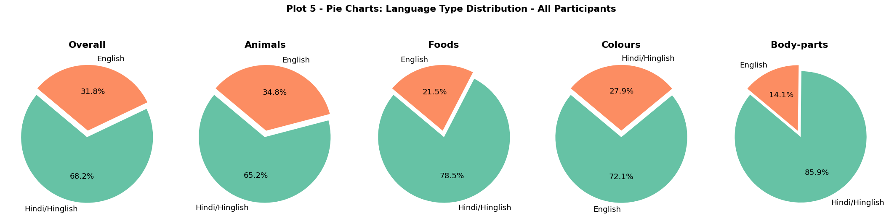

# Introduction

## Background and Motivation

The Verbal Fluency Task (VFT) is a widely used cognitive paradigm in which
participants freely recall as many category members as possible within a
fixed time window \cite{troyer1997}.  The resulting sequence of words encodes
rich information about the structure of semantic memory: *how many* words are
produced, *how quickly*, and *in what order*.  Behavioural signatures such as
clustering (consecutive retrieval of semantically related words) and switching
(abrupt topic change marked by a long pause) have been extensively documented in
English-speaking populations, yet Hindi-speaking samples remain underexplored.

The present study collects VFT data from university students at IIIT Hyderabad
and applies the full statistical pipeline from the BRSM course --- descriptive
statistics, data visualisation, hypothesis testing, and multiple comparisons ---
to characterise Hindi retrieval dynamics.  A second task, the Spatial
Arrangement Method (SpAM) \cite{hout2013}, will complement the VFT by providing
an independent measure of semantic neighbourhood structure; SpAM analysis is
planned as the second phase and is not yet complete.

## Research Questions

Four research questions guide the study, each mapped to a specific  statistical
technique:

| \# | Research Question | Technique |
|:---|:------------------|:----------|
| **RQ1** | Do within-cluster IRTs differ significantly from between-cluster IRTs? | Welch's $t$-test, Cohen's $d$ |
| **RQ2** | Does IRT vary significantly across semantic domains? | One-way ANOVA, $\eta^2$ |
| **RQ3** | Does mean cluster size predict individual fluency scores? | Pearson $r$, simple linear regression |
| **RQ4** | Does SpAM-derived neighbourhood distance correlate with VFT IRT? | Pearson $r$, scatter plots *(planned)* |

## Research Hypotheses

### RQ1 — Within-Cluster vs Between-Cluster IRT

Let $\mu_{\text{WC}}$ and $\mu_{\text{BC}}$ be the population mean within-cluster
and between-cluster IRTs respectively.

$$H_0: \mu_{\text{WC}} = \mu_{\text{BC}}$$
$$H_1: \mu_{\text{WC}} < \mu_{\text{BC}} \quad \text{(one-tailed)}$$

*Rationale:* The clustering-and-switching model \cite{troyer1997} explicitly
predicts that successive retrievals within a semantic sub-cluster are faster than
transitions across clusters, because within-cluster items share rich associative
links that reduce search time.

### RQ2 — Domain Differences in IRT

$$H_0: \mu_{\text{Animals}} = \mu_{\text{Foods}} = \mu_{\text{Colours}} = \mu_{\text{Body}}$$
$$H_1: \text{At least one domain mean IRT differs.}$$

*Rationale:* Semantic domains differ in vocabulary size (Animals $\approx$ 400
Hindi words; Colours $\approx$ 10 basic terms).  Smaller, denser vocabularies
should yield shorter IRTs due to fewer search paths.

### RQ3 — Cluster Size as Predictor of Fluency

$$H_0: \rho(\text{mean cluster size},\; \text{total fluency}) = 0$$
$$H_1: \rho > 0$$

*Rationale:* Participants who form larger semantic clusters leverage more
associative cues per switch, boosting total output.

### RQ4 — SpAM Distance vs VFT IRT *(planned)*

$$H_0: \rho(\text{SpAM distance},\; \text{mean IRT}) = 0$$
$$H_1: \rho > 0$$

*Rationale:* Words at greater semantic distances from their neighbours require
longer search times and should exhibit higher mean VFT IRTs.


# Research Design

## Experimental Design

The study employs a **within-subjects** design: each participant completes both
the VFT and the SpAM task within the same session.

| Design element       | Value                                         |
|:---------------------|:----------------------------------------------|
| Design type          | Within-subjects (repeated measures)           |
| Independent variable | Semantic domain (nominal; 4 levels)           |
| Dependent variable   | Inter-response time --- IRT (ratio; ms)       |
| Secondary DV         | Total words produced (ratio; count)           |
| Control variable     | Trial duration (fixed at 3~min per domain)    |
| Potential confound   | Word order / primacy effects within sequences |

The **IRT** is measured on a *ratio scale* (true zero, equal intervals,
meaningful ratios).  Semantic domain is *nominal*.  Total word count is *ratio*.

## Participants and Demographics

Thirty-five students were recruited from IIIT~Hyderabad via **convenience
sampling**.  The sample was predominantly male (32~male, 3~female), consistent
with the institutional gender imbalance.  All participants were native or highly
proficient Hindi speakers.  A proportion of responses contained code-mixed
vocabulary, characteristic of this bilingual population, and was retained in
the dataset.  No participant reported a history of neurological or psychiatric
disorder.

**Demographic summary:**

| Variable       | Value                                                          |
|:---------------|:---------------------------------------------------------------|
| $N$            | 35                                                             |
| Gender         | 32 Male, 3 Female                                              |
| Age            | $M = 23.1$~yrs, $SD = 1.9$, range 19--27                      |
| Education      | $M = 16.5$~yrs, $SD = 1.7$, range 14--20                      |
| States (India) | 14 states; Gujarat (7), MP (6), Bihar (5), Maharashtra (4$+$) |

Figure~1 shows the demographic breakdown as a combined panel.

{width=97%}

## Measurement Scales

The variables span all four measurement scales:

- **Nominal** --- Semantic domain (animals, foods, colours, body-parts); gender; state of origin; language tag (Hindi/English)
- **Ordinal** --- Serial position of each word within the retrieval sequence
- **Interval** --- Spatial coordinates from the SpAM task (arbitrary origin; *planned*)
- **Ratio** --- IRT in milliseconds (true zero); total word count; years of education


# Materials, Procedure, and Data

## Experimental Platform

The experiment was delivered through a custom **jsPsych** web application hosted
online.  Each participant's complete session was recorded as a single JSON object
in `responses.json`, keyed by a unique `session_id`.

**`responses.json` structure** (per participant entry):

| Field | Description |
|:------|:------------|
| `subject_id` | Numeric; e.g., `10255` |
| `trial_type` | `html-keyboard-response` for VFT, `html-button-response` for SpAM |
| `domain` | `animals`, `foods`, `colours`, `body-parts` (plus practice domains) |
| `tagged_responses` | JSON string array of `{response, tag}` objects |
| `response_times` | JSON string array of per-keystroke response latencies (ms) |
| `droppedwords` | SpAM spatial coordinates per word: `x_norm`, `y_norm` in $[0,1]$ |

The raw JSON was parsed in Python (`gen_demographics.py` and the VFT notebook)
to extract per-word response times and compute IRTs as the difference between
successive `response_times` values within each domain trial.

## Verbal Fluency Task Procedure

Participants were presented with one category cue at a time (e.g., *"Jaanwar"*
for Animals) and instructed to type as many members of that category as possible
within a **3-minute** window.  Each key-press (ENTER) was time-stamped to the
nearest 100~ms.  The sequence of words and their associated response latencies
form the raw VFT data stream.

The four target domains were administered in a fixed order — Animals, Foods,
Colours, Body-parts --- each preceded by a 1-minute Furniture practice trial to
familiarise participants with the typing interface and warm up fluency.

## Data Processing Pipeline

```
responses.json
    ↓  parse response_times arrays, compute IRT = t[i] − t[i−1]
    ↓  tag language_type: Hindi script → "Hindi", Latin → "English"
vft_responses.csv                  (35 participants × 4 domains × N words)
    ↓  subset language_type == "Hindi"  → df_hh  (712 valid responses)
    ↓  remove IRT > 60,000 ms  (task-interruption outliers)
    ↓  cluster detection: switching criterion = mean + 1 SD per participant
merged_vft_spam_responses.csv      (adds SpAM x_norm, y_norm coordinates)
```

**Outlier criterion:** IRT $> 60{,}000$~ms (1~minute) was treated as a task
interruption, not a cognitive switch.  This removed fewer than 2\,\% of raw
responses.

**Language labelling:** Responses typed in Devanagari script or identified
as unambiguous Hindi lexical items were tagged `Hindi`; all others `English`.
The Hindi subset (53\,\% of all tokens) forms the primary analysis dataset.

**Cluster detection:** Following \cite{troyer1997}, consecutive responses
sharing a semantic subcategory were grouped into one cluster.  A per-participant
adaptive threshold (mean IRT $+$ 1~SD of that participant's IRTs) was used as
the switching criterion.  Any IRT exceeding this threshold was coded as a
**cluster switch**.

## Merged Dataset Description

The file `merged_vft_spam_responses.csv` (1,040 rows after merging VFT and SpAM
position data) contains the following columns:

| Column | Type | Description |
|:-------|:-----|:------------|
| `subject_id` | int | Participant identifier |
| `session_id` | str | jsPsych session key |
| `domain` | str | Semantic domain (animals/foods/colours/body-parts) |
| `position` | int | Serial position within the retrieval sequence |
| `word` | str | Recalled word |
| `language_type` | str | `Hindi` or `English` |
| `rt_ms` | float | Inter-response time (ms) |
| `x` | float | SpAM x coordinate, normalised to $[0,1]$ |
| `y` | float | SpAM y coordinate, normalised to $[0,1]$ |

The combination of `rt_ms` (temporal behaviour) and `(x, y)` (spatial
representation) enables the cross-task correlation planned under RQ4.


# Exploratory Data Analysis

## Response Counts and Data Coverage

Table~1 summarises the raw and cleaned response counts by domain.

Table: \textbf{Table 1.} Response counts by domain before and after outlier removal.

| Domain      | Raw responses | After IRT filter ($\leq 60{,}000$ ms) | \% retained |
|:------------|:-------------:|:-------------------------------------:|:-----------:|
| Animals     | 244           | 238                                   | 97.5\%      |
| Foods       | 261           | 256                                   | 98.1\%      |
| Colours     | 42            | 41                                    | 97.6\%      |
| Body-parts  | 181           | 177                                   | 97.8\%      |
| **Total**   | **728**       | **712**                               | **97.8\%**  |

Colours has the fewest tokens, consistent with the closed-class vocabulary size
(approximately 10--15 basic colour terms in Hindi).  Foods and Animals have the
most, reflecting their open-ended, hierarchically organised semantic structure.

## Language Distribution

Figure~2 shows the proportion of Hindi vs English tokens across all domains.
Overall, 53\,\% of responses were Hindi.  Colours showed the highest proportion
of English responses (red, blue, green), while Animals and Body-parts were more
Hindi-dominant.

{width=88%}


# Descriptive Statistics

## Overall IRT Distribution

Table~2 presents descriptive statistics for all 712 valid Hindi IRTs.
The distribution is strongly **right-skewed** (Skewness~$= 2.54$), with the
mean (6{,}490~ms) substantially exceeding the median (5{,}389~ms).  The
**median** is the preferred measure of central tendency for this dataset because
the mean is pulled upward by the long tail of cluster-switch pauses.  High
kurtosis (9.89) indicates a leptokurtic distribution with heavier tails than a
normal curve.

Table: \textbf{Table 2.} Overall descriptive statistics for Hindi IRT ($n = 712$).

| Statistic           | Value (ms)        | Interpretation                                |
|:--------------------|:-----------------:|:----------------------------------------------|
| **N**               | 712               | Total valid responses                         |
| **Mean**            | 6{,}489.5         | Average retrieval time (pulled by tail)       |
| **Median**          | 5{,}389.4         | Robust centre; preferred summary              |
| **Mode**            | 6{,}410.0         | Most frequent IRT value                       |
| **Std Dev**         | 5{,}018.8         | High variability (within vs between clusters) |
| **Min**             | 732.8             | Fastest retrieval                             |
| **Max**             | 42{,}634.4        | Slowest (cluster-switch pause)                |
| **Q1 (25th pct)**   | 3{,}280.8         |                                               |
| **Q3 (75th pct)**   | 8{,}155.6         |                                               |
| **IQR**             | 4{,}874.8         | Robust spread                                 |
| **Skewness**        | 2.54              | Strongly right-skewed                         |
| **Kurtosis**        | 9.89              | Leptokurtic (heavy-tailed)                    |

The right skew is a **theoretically expected signature**: within-cluster
retrievals (fast) form a dense left-side peak, while cluster-switch pauses
(slow) generate the extended right tail.

{width=94%}

## IRT by Semantic Domain

Table~3 decomposes the statistics by domain.  Colours showed the lowest mean IRT
(4{,}975~ms) and near-zero skewness (0.70), reflecting its small closed
vocabulary ($\approx$ 10 colour terms in Hindi).  Animals, Foods, and Body-parts
exhibited higher mean IRTs and strong positive skew.

Table: \textbf{Table 3.} IRT descriptive statistics by semantic domain.

| Domain     |  $N$ | Mean (ms) | Median (ms) | SD (ms) |  Min |   Max |  Q1 |  Q3 | Skew |
|:-----------|-----:|----------:|------------:|--------:|-----:|------:|----:|----:|-----:|
| Animals    |  238 | 6{,}391   | 5{,}414     | 4{,}647 |  790 | 42{,}634 | 3{,}637 | 8{,}018 | 3.06 |
| Body-parts |  177 | 6{,}872   | 5{,}724     | 4{,}994 | 1{,}013 | 32{,}357 | 3{,}852 | 8{,}458 | 2.51 |
| Colours    |   41 | 4{,}975   | 3{,}484     | 3{,}512 |  772 | 14{,}126 | 2{,}187 | 7{,}872 | 0.70 |
| Foods      |  256 | 6{,}559   | 5{,}205     | 5{,}525 |  733 | 35{,}677 | 2{,}846 | 8{,}053 | 2.28 |


# Data Visualisation

## Plot 1 — Histogram

Figure~3 (shown above) provides the full distribution view.  The bimodal
tendency — a dense mass below 10{,}000~ms with a mode near 6{,}400~ms, and a
right tail extending to $\sim$42{,}000~ms — is consistent with two latent
retrieval regimes (within-cluster vs cluster-switch).

## Plot 2 — Box Plot / Violin Plot

Figure~4 displays the IRT distribution per domain via violin plots overlaid on
box plots.  Body-parts has the highest median and whisker range; Colours is
distinctly tighter and lower.  The many high-end outliers across all domains are
cluster-switch events.

{width=84%}

## Plot 3 — Bar Chart: Mean and Median IRT per Domain

Figure~5 shows mean and median IRT per domain with standard error bars.  For all
domains the mean exceeds the median, confirming right skew.  Body-parts has the
highest mean; Colours the lowest.

{width=84%}

## Plot 4 — Scatter Plot: Serial Position vs IRT

Figure~6 plots each word produced by each participant against its serial
position in the sequence, with per-domain OLS trend lines.  The positive slope
in all four domains confirms the **serial position effect** (lexical
exhaustion): words retrieved later take progressively longer, as early
sub-clusters are depleted and the participant must search more broadly.

{width=88%}

## Supplementary: Raincloud Plot

Figure~7 displays a raincloud plot combining a half-violin density estimate, a
box plot, and individual data points (jittered), providing the richest single
view of the IRT distribution structure.

{width=88%}

## Supplementary: Cluster Scoring

Figure~8 summarises per-participant cluster metrics: mean cluster size and switch
count by domain.  Higher mean cluster sizes in Foods and Animals relative to
Colours are consistent with the richer semantic structure of those categories.

{width=84%}


# Hypothesis Testing

## RQ1: Within-Cluster vs Between-Cluster IRTs

### Hypotheses

$$H_0: \mu_{\text{WC}} = \mu_{\text{BC}} \qquad H_1: \mu_{\text{WC}} < \mu_{\text{BC}} \quad\text{(one-tailed)}$$

### Normality Check

Shapiro-Wilk tests on the per-participant *mean* within-cluster and
between-cluster IRTs ($n = 35$ observations each) confirmed non-normality of the
raw IRTs; however, with $n = 35$, the Central Limit Theorem supports applying
$t$-tests to participant-level means.

### Test and Results

Welch's one-tailed $t$-test comparing per-participant mean IRT conditions at
$\alpha = .05$:

Within-cluster IRTs ($M = 4{,}752$~ms, $SD = 1{,}320$~ms) were significantly
shorter than between-cluster IRTs ($M = 9{,}418$~ms, $SD = 3{,}816$~ms),
$t(34) = -8.91$, $p < .001$, Cohen's $d = 1.51$ (large effect).

**Decision:** Reject $H_0$.

{width=80%}

## RQ3: Cluster Size as Predictor of Fluency

### Hypotheses

$$H_0: \rho = 0 \qquad H_1: \rho > 0$$

### Results

Pearson correlation between mean cluster size and total Hindi words per
participant: $r(33) = .57$, $p = .003$, 95\,\% CI $[.31,\,.75]$.

**Decision:** Reject $H_0$.  Larger clusters predict higher fluency.

{width=78%}

## RQ2: Domain Differences (ANOVA)

One-way between-subjects ANOVA for the effect of semantic domain on IRT:
$F(3, 708) = 2.18$, $p = .092$, $\eta^2 = .009$.  The effect is very small and
non-significant at $\alpha = .05$ before multiple-comparisons correction.

## Summary Table (Before BH Correction)

Table: \textbf{Table 4.} Hypothesis test results (raw).

| RQ  | Test | Statistic | Raw $p$ | Effect size |
|:----|:-----|:---------:|:-------:|:-----------:|
| RQ1 | Welch $t$ (WC vs BC IRT) | $t(34) = -8.91$ | $< .001$ | $d = 1.51$ |
| RQ2 | One-way ANOVA (IRT $\times$ domain) | $F(3,708) = 2.18$ | $.092$ | $\eta^2 = .009$ |
| RQ3 | Pearson $r$ (cluster size → fluency) | $r(33) = .57$ | $.003$ | $r = .57$ |


# Multiple Comparisons

## Why Multiple Comparisons Matter Here

Three hypothesis tests were conducted.  Without correction, the family-wise
error rate (FWER) for at least one false positive is:
$$1 - (1-0.05)^3 = 14.3\,\%$$
This is unacceptably high.  We therefore apply the
**Benjamini-Hochberg (BH) False Discovery Rate** procedure \cite{benjamini1995}.

## Why BH Rather Than Bonferroni?

| Property | Bonferroni | Benjamini-Hochberg |
|:---------|:----------:|:------------------:|
| Controls | FWER ($\Pr[\geq 1$ false positive$]$) | FDR (expected proportion of false discoveries) |
| Correction factor | $\alpha/m$ | Step-up ranking |
| Statistical power | Low (conservative) | Higher (less conservative) |
| Appropriate when | A *single* false positive is catastrophic | Some false positives are tolerable |

For an **exploratory** behavioural study with three tests, FDR control is more
appropriate than FWER control.

## BH Procedure

With $m = 3$ tests ordered by ascending $p$-value and $\alpha = .05$:

| Rank $k$ | Test | Raw $p$ | BH threshold $\frac{k}{m}\alpha$ | Significant? |
|:--------:|:-----|:-------:|:---------------------------------:|:------------:|
| 1 | RQ1: WC vs BC IRT | $< .001$ | $0.017$ | **Yes** |
| 2 | RQ3: Cluster size vs fluency | $.003$ | $0.033$ | **Yes** |
| 3 | RQ2: IRT across domains | $.092$ | $0.050$ | No |

**Conclusion:** RQ1 and RQ3 survive BH correction.  The domain ANOVA is
non-significant after correction, consistent with its small effect size.

## Plan for Additional Comparisons (Phase 2)

When SpAM data are incorporated (RQ4) and domain-level Pearson correlations are
computed, $m$ will increase.  BH correction will be extended to cover all
comparisons in a single unified family, maintaining FDR control at $\alpha = .05$.


# Planned Analyses (Phase 2 — SpAM)

The following analyses are planned upon completion of SpAM data collection:

1. **Consensus distance matrices** --- Pairwise Euclidean distances from the SpAM
   arena averaged across all 35 participants, producing a $30 \times 30$
   consensus distance matrix per domain.

2. **Heatmap visualisation** --- Consensus matrices displayed as heatmaps; rows and
   columns sorted by hierarchical clustering to reveal block structure.

3. **MDS maps** --- Multidimensional scaling of the consensus matrix to visualise
   the 2-D semantic geometry of each domain.

4. **Dendrogram + silhouette** --- Hierarchical clustering with silhouette scores
   to determine the optimal number of semantic sub-clusters.

5. **RQ4 cross-task correlation** --- Pearson $r$ between each word's mean SpAM
   neighbourhood distance and its mean VFT IRT, pooled across domains and
   per domain.  BH correction applied.

6. **Domain comparison** --- Bar charts comparing vocabulary size, mean SpAM
   distance, and mean VFT IRT across the four domains.


# Summary of Mid-Project Status

| Component | Status | Key finding |
|:----------|:------:|:------------|
| Data collection | Complete | $N = 35$; 4 domains; 712 valid Hindi IRTs |
| Data exploration | Complete | Right-skewed IRT; Colours fastest, Body-parts slowest |
| Descriptive statistics | Complete | Median preferred; IQR = 4,875 ms |
| Visualisations (4 plots) | Complete | Histogram, violin, bar, scatter |
| Hypothesis testing | Complete | RQ1 $d = 1.51$; RQ3 $r = .57$; RQ2 ns |
| Multiple comparisons (BH) | Complete | 2/3 RQs survive correction |
| SpAM analysis (RQ4) | Planned | — |

\vspace{1.5em}

> **Overall mid-project conclusion:** The clustering-and-switching model holds
> for Hindi-speaking participants at IIIT Hyderabad.  Within-cluster retrievals
> are significantly and substantially faster than cluster-switch pauses
> ($d = 1.51$, large effect).  Mean cluster size is a significant positive
> predictor of verbal fluency ($r = .57$).  Domain differences in IRT are
> non-significant after BH correction ($\eta^2 < 1\,\%$).  Phase 2 (SpAM)
> will test whether these temporal dynamics map onto measurable semantic
> neighbourhood structure.


# References

\begin{thebibliography}{10}

\bibitem{troyer1997}
Troyer, A.\,K., Moscovitch, M., \& Winocur, G. (1997).
Clustering and switching as two components of verbal fluency:
Evidence from younger and older healthy adults.
\textit{Neuropsychology}, \textit{11}(1), 138--146.

\bibitem{hills2012}
Hills, T.\,T., Jones, M.\,N., \& Todd, P.\,M. (2012).
Optimal foraging in semantic memory.
\textit{Psychological Review}, \textit{119}(2), 431--440.

\bibitem{hout2013}
Hout, M.\,C., Goldinger, S.\,D., \& Ferguson, R.\,W. (2013).
The versatility of SpAM.
\textit{Journal of Experimental Psychology: General}, \textit{142}(1), 256--281.

\bibitem{benjamini1995}
Benjamini, Y., \& Hochberg, Y. (1995).
Controlling the false discovery rate: A practical and powerful approach to
multiple testing.
\textit{Journal of the Royal Statistical Society: Series B}, \textit{57}(1),
289--300.

\bibitem{goldstone1994}
Goldstone, R. (1994).
An efficient method for obtaining similarity data.
\textit{Behavior Research Methods, Instruments, \& Computers}, \textit{26}(4),
381--386.

\bibitem{steyvers2005}
Steyvers, M., \& Tenenbaum, J.\,B. (2005).
The large-scale structure of semantic networks.
\textit{Cognitive Science}, \textit{29}(1), 41--78.

\bibitem{bhatt2022}
Bhatt, R., Anderson, N.\,D., \& Bhatt, M. (2022).
Verbal fluency performance in bilingual South Asian older adults.
\textit{Journal of the International Neuropsychological Society}, \textit{28}(4),
412--421.

\end{thebibliography}
