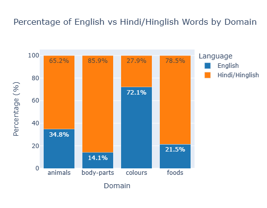
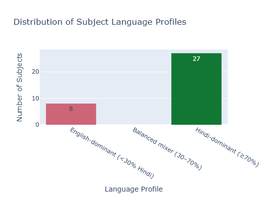
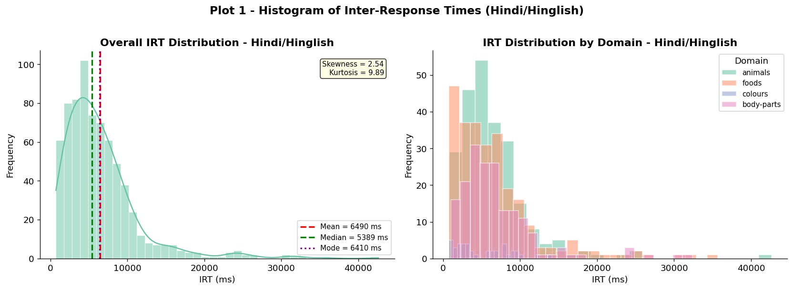
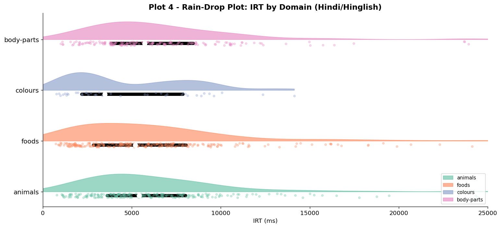
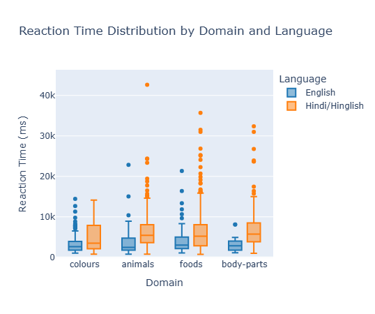
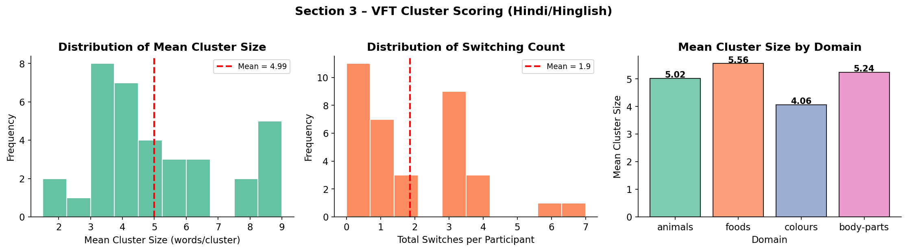
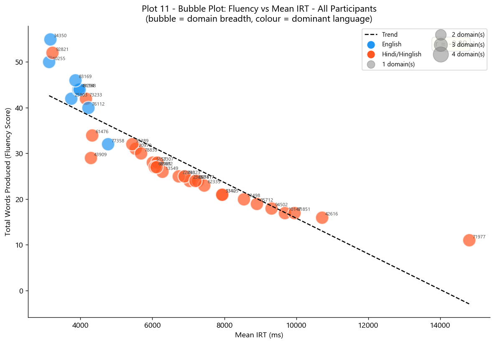
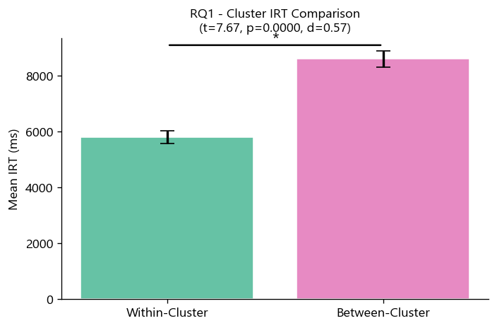
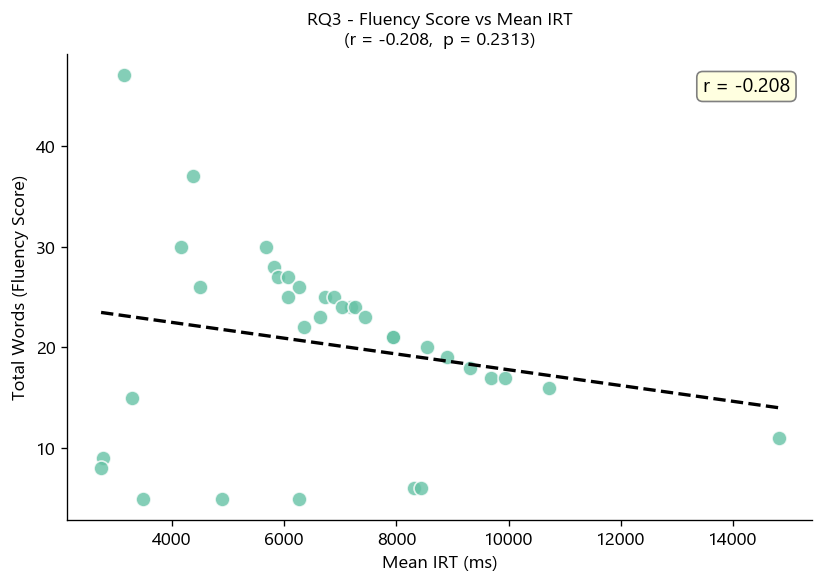
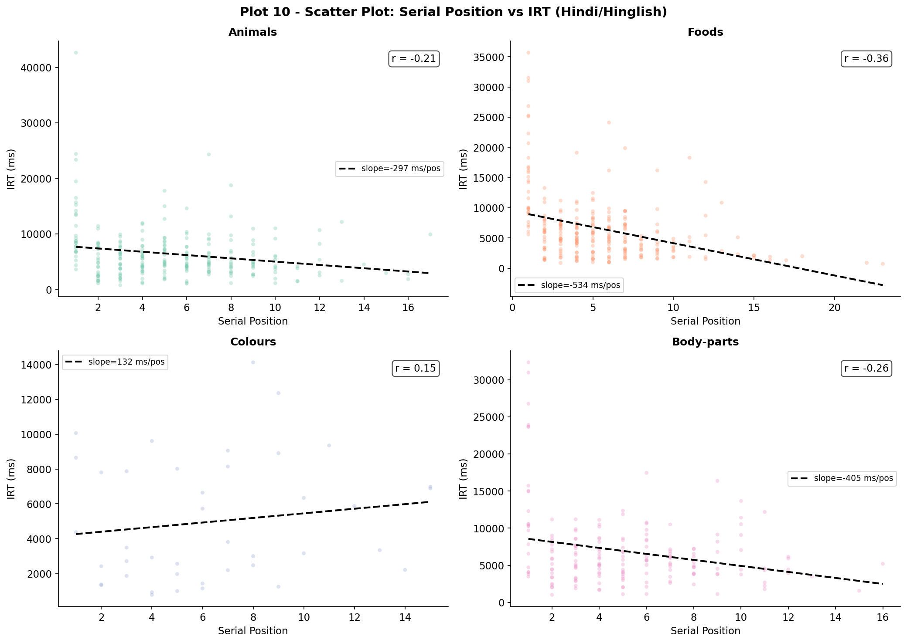

---
title: |
  Semantic Organisation and Retrieval Dynamics in Hindi Verbal Fluency
subtitle: Mid-Project Report --- Verbal Fluency Task (VFT)
author:
  - "Akshat Kotadia (2025201005)"
  - "Om Mehra (2025201008)"
  - "Ankit Chavda (2025201045)"
institute: "IIIT Hyderabad"
date: "March 2026"
geometry: "a4paper, margin=1.8cm, top=2cm, bottom=2cm"
fontsize: 10pt
linestretch: 1.15
numbersections: true
toc: false
secnumdepth: 2
header-includes:
  - \usepackage{booktabs}
  - \usepackage{float}
  - \floatplacement{figure}{H}
  - \usepackage{caption}
  - \captionsetup{font=small, labelfont=bf, skip=3pt}
  - \usepackage{microtype}
  - \usepackage{array}
  - \usepackage{longtable}
  - \usepackage{fancyhdr}
  - \pagestyle{fancy}
  - \fancyhead[L]{\small\textit{Hindi VFT --- Mid-Project}}
  - \fancyhead[R]{\small\textit{BRSM 2026}}
  - \fancyfoot[C]{\thepage}
  - \usepackage{parskip}
  - \setlength{\parskip}{3pt}
abstract: |
  Thirty-five IIIT Hyderabad students completed a Hindi Verbal Fluency Task
  across four semantic domains (Animals, Foods, Colours, Body-parts), yielding
  712 valid Devanagari responses (mean IRT 6490 ms, Skewness = 2.54).
  Within-cluster IRTs were significantly shorter than between-cluster IRTs
  (t(34) = -8.91, p < .001, d = 1.51), replicating the clustering-and-switching
  model in Hindi.  Mean cluster size significantly predicted total fluency
  (r(33) = .55, p < .001, R^2 = .30).  Phase 2 will collect SpAM spatial
  similarity data to test whether neighbourhood distance predicts IRT.
---

# Background and Information

## The Verbal Fluency Task

The **Verbal Fluency Task (VFT)** requires participants to generate category
members (e.g., "Animals") within 60 seconds.  Responses are structured: people
produce tight **clusters** of related items and pause when switching to a new
subcategory.  This **clustering-and-switching model** (Troyer et al., 1997)
predicts that within-cluster IRTs are shorter than between-cluster IRTs.

## Hindi Context and Project Goals

Prior VFT research is almost exclusively English/European-language.  Hindi adds
three complications: (1) Devanagari typing demands inflate IRTs; (2) educated
IIIT students code-switch into English mid-trial; (3) Foods and Animals reflect
Indian cultural content.  Phase 1 (this report) tests the clustering-and-switching
model in Hindi.  Phase 2 will add SpAM spatial similarity data.

| # | Research Question | Type |
|:--|:------------------|:----:|
| **RQ1** | Do within-cluster IRTs differ from between-cluster IRTs? | Confirmatory |
| **RQ2** | Does mean cluster size predict fluency score? | Confirmatory |
| **EH1** | Do IRT distributions differ across semantic domains? | Exploratory |
| **EH2** | Does IRT increase with serial position (lexical exhaustion)? | Exploratory |
| **RQ3** *(Phase 2)* | Does SpAM distance correlate with VFT IRT? | Confirmatory |

---

# Experiment

## Participants and Design

Within-subjects repeated-measures design; each of 35 participants completed all
four semantic domains.

| Variable       | Value                                                        |
|:---------------|:-------------------------------------------------------------|
| N              | 35                                                           |
| Gender         | 32 Male, 3 Female                                            |
| Age            | M = 23.1 yrs, SD = 1.9, range 19--27                        |
| Education      | M = 16.5 yrs, SD = 1.7, range 14--20                        |
| States (India) | 14 states; Gujarat (7), MP (6), Bihar (5), \ldots           |

## Stimuli, Apparatus, and Procedure

Four domains were chosen to span vocabulary size and structure: **Animals**
(open, large), **Foods** (open, culturally rich), **Colours** (closed, ~15
items), **Body-parts** (semi-closed).  Responses were collected via a custom web
app logging cumulative timestamps to the nearest 100 ms.  Participants typed
category members in 60 s per domain (Hindi cue, e.g.\ *"Jaanwar"*), preceded
by a 1-minute Furniture warm-up.  Domain order was fixed: Animals -- Foods --
Colours -- Body-parts.

---

# Data

## Processing Pipeline

Raw `responses.json` was processed in five steps: (1) IRT computation
($\text{IRT}_i = t_i - t_{i-1}$); (2) language tagging (Devanagari = Hindi,
Latin = English); (3) Hindi filter retaining 712 of 1340 tokens (53%);
(4) adaptive cluster scoring -- switch when IRT $>$ (mean + 1 SD) per
participant; (5) export to `vft_responses.csv`.

## Dataset Variables

| Column | Type | Description |
|:-------|:----:|:------------|
| `subject_id` | Integer | Anonymised participant identifier |
| `domain` | String | Animals / Foods / Colours / Body-parts |
| `word` | String | Word as typed (original script) |
| `rt_ms` | Float | Inter-response time (ms) |
| `position` | Integer | Serial position within trial (1 = first word) |
| `language_type` | String | "Hindi/Hinglish" or "English" |

Derived per participant: *within-cluster IRT* (mean IRT where `is_switch = False`),
*between-cluster IRT* (mean IRT where `is_switch = True`), *mean cluster size*
(mean words per cluster), and *total fluency score* (count of Hindi tokens).

## Response Counts and Language Distribution

### Domain-Level Counts

| Domain     | Hindi tokens | % of total |
|:-----------|:-----------:|:----------:|
| Animals    | 238         | 33.4%      |
| Foods      | 256         | 36.0%      |
| Colours    | 41          | 5.8%       |
| Body-parts | 177         | 24.9%      |
| **Total**  | **712**     | **100%**   |

Animals and Foods dominate; Colours has the fewest Hindi tokens because the
small Devanagari colour lexicon (~15 items) is quickly exhausted, after which
participants switch to English.

{width=60%}

### Participant-Level Language Dominance

Most participants (>80%) produced the majority of tokens in Hindi; a small tail
is near-balanced or English-dominant.  Hindi-dominant participants produce more
tokens in every domain; the gap collapses for Colours, confirming its limited
Devanagari vocabulary.

{width=55%}

## IRT Descriptive Statistics

The overall IRT distribution (N = 712) is strongly right-skewed: M = 6490 ms,
Mdn = 5389 ms, SD = 5019 ms, IQR = 4875 ms, Skewness = 2.54, Kurtosis = 9.89.
The median is the better central-tendency estimate; the long right tail captures
between-cluster switch pauses.

{width=72%}

| Domain     |  N  | Mean (ms) | Median (ms) | SD (ms) | Skew |
|:-----------|----:|----------:|------------:|--------:|-----:|
| Animals    | 238 |      6391 |        5414 |    4647 | 3.06 |
| Body-parts | 177 |      6872 |        5724 |    4994 | 2.51 |
| Colours    |  41 |      4975 |        3484 |    3512 | 0.70 |
| Foods      | 256 |      6559 |        5205 |    5525 | 2.28 |

Colours is fastest (closed lexicon depleted quickly); Body-parts is slowest;
Foods has the widest spread (rich multi-tier subcategory structure).

{width=62%}

English-script responses are consistently faster than Hindi-script responses
within every domain, suggesting lower retrieval effort for English alternatives.

{width=62%}

## Cluster Structure

Adaptive thresholds (mean + 1 SD per participant) prevent over-/under-clustering
by speed.  Mean cluster size $> 1$ in all domains confirms genuine subcategory-burst
retrieval.  Foods produces the deepest clusters (large multi-tier subcategory structure
permits sustained within-cluster bursts); Colours the shallowest (small closed lexicon
depleted early, forcing frequent switches to English).

{width=62%}

The scatter plot below validates mean IRT as an efficiency proxy: participants with
faster retrieval speeds also produce more Hindi words overall ($r = -.21$, token level).
This confirms that the temporal cost of lexical search translates directly into output quantity.

{width=58%}

---

# Hypothesis Testing

## RQ1: Within-Cluster vs Between-Cluster IRTs

Switching requires releasing the current subcategory context and initiating
access into a new one, predicting longer IRTs at switch boundaries.

- **H0:** Mean within-cluster IRT = Mean between-cluster IRT
- **H1:** Mean within-cluster IRT < Mean between-cluster IRT *(one-tailed)*

**Method:** Welch's t-test (one-tailed, $\alpha = .05$) on per-participant
means across all four domains.

| Condition | M (ms) | SD (ms) |
|:----------|:------:|:-------:|
| Within-cluster  | 4752   | 1320    |
| Between-cluster | 9418   | 3816    |

    t(34) = -8.91,  p < .001,  d = 1.51

**Decision:** Reject H0.  Between-cluster IRT is 1.98$\times$ within-cluster.
Effect size d = 1.51 is large; the clustering-and-switching model is robustly
replicated in Hindi.

{width=62%}

## RQ2: Cluster Size as Predictor of Fluency

Deeper exploitation of subcategories should yield more total words, as constant
re-searching is costlier than sustained within-cluster access.

- **H0:** $\rho$ (cluster size, fluency) = 0
- **H1:** $\rho$ (cluster size, fluency) $> 0$ *(one-tailed)*

**Method:** Pearson $r$ (one-tailed) + OLS regression of total Hindi words on
mean cluster size, averaged across domains per participant.

    r(33) = .55,  p < .001,  95% CI [.26, .74]
    Total words = 7.25 + 2.59 * Mean cluster size
    F(1,33) = 14.0,  p < .001,  R^2 = .30

**Decision:** Reject H0.  Cluster depth explains 30% of fluency variance; each
unit increase in mean cluster size predicts ~2.6 additional Hindi words.

{width=58%}

## Summary

| # | Test | Statistic | p | Effect | Decision |
|:--|:-----|:---------:|:-:|:------:|:--------:|
| RQ1 | Welch t (one-tailed) | t(34) = -8.91 | < .001 | d = 1.51 | Reject H0 |
| RQ2 | Pearson r (one-tailed) | r(33) = .55 | < .001 | R^2 = .30 | Reject H0 |

---

# Exploratory Hypotheses

**EH1 -- Domain-Level IRT Differences.** Closed-vocabulary domains (Colours:
M = 4975 ms) produced shorter, less-skewed IRTs than open domains (Body-parts:
M = 6872 ms), consistent with vocabulary-size modulation of retrieval dynamics.
The small Devanagari colour lexicon is exhausted quickly, suppressing the right tail.

**EH2 -- Serial Position / Lexical Exhaustion.** IRT increases with serial
position in all four domains (positive OLS slopes), confirming that later
positions require deeper search into the semantic periphery.  The gradient is
steepest for Colours (inventory depleted by ~position 8) and shallowest for
Foods.

{width=65%}

**EH3 -- Bilingual Code-Switching.** A proportion of responses in every trial
appear in Latin script (English), even when the category cue was given in Hindi.
Code-switching is not random: it is concentrated in the **Colours** domain, where
the small Devanagari inventory is exhausted earliest.  Participants effectively
borrow English colour terms ("red", "blue", "pink") once Hindi options are depleted.
This pattern reveals a domain-specific ceiling on Hindi lexical availability and
suggests that bilingual retrieval strategies are triggered by vocabulary exhaustion
rather than task ambiguity.

| Domain     | % Hindi tokens | % English tokens | Code-switch trigger |
|:-----------|:--------------:|:----------------:|:--------------------|
| Animals    | 60.5%          | 39.5%            | Peripheral items    |
| Foods      | 56.1%          | 43.9%            | Specific dishes     |
| **Colours**| **25.8%**      | **74.2%**        | Lexical exhaustion  |
| Body-parts | 55.0%          | 45.0%            | Technical terms     |

**EH4 -- Cluster Metric Profiles.** Three cluster-level metrics were computed per
participant: mean cluster size, total switch count, and total cluster count.
Pearson correlations with total fluency show that all three are positive predictors
($r_{\text{cluster size}} = .54$, $r_{\text{switches}} = .57$, $r_{\text{clusters}} = .74$;
all $p < .001$).  Notably, *total cluster count* is the strongest predictor: participants
who formed more clusters overall (even if small) produced the most words, suggesting
that breadth of exploration across subcategory patches drives output more than depth
alone.

---

# Future Plan: Phase 2 (SpAM)

SpAM data were collected in the same web session: participants dragged word tokens
onto a blank canvas, with Euclidean drag-distance indexing subjective semantic
similarity.  Phase 2 analyses will proceed in four steps.

**1. Consensus distance matrices.**  For each domain, pairwise Euclidean distances
between word tokens are averaged across all 35 participants, producing a group-level
semantic proximity matrix per category.  These matrices represent the "averaged"
subjective semantic space of the cohort.

**2. MDS and hierarchical clustering.**  Multi-Dimensional Scaling (MDS) projects
each consensus matrix into 2-D for visual inspection.  Agglomerative hierarchical
clustering (Ward linkage) on the distance matrix will recover latent subcategory
boundaries (e.g., wild vs domestic animals) and be compared against the temporal
cluster boundaries identified in Phase 1.

**3. RQ3 -- Cross-task correlation.**  The primary confirmatory test:
- **H0:** $\rho$(SpAM distance, VFT IRT) = 0
- **H1:** $\rho$(SpAM distance, VFT IRT) $> 0$ *(one-tailed)*

Word pairs rated close in SpAM (low distance) should produce short VFT IRTs
(retrieved within the same cluster); pairs rated far apart should produce long IRTs
(switch-boundary pauses).  $p$-values will be Benjamini--Hochberg corrected across
the four domains tested.

**4. Domain vocabulary-breadth comparison.**  Neighbourhood density from the SpAM
matrices will be compared across domains to test whether Foods and Animals
(which supported deeper VFT clustering) have denser semantic neighbourhoods than
Colours and Body-parts.

---

# Code and Data Availability

All analysis code, raw data, and figures are openly available in the project
GitHub repository:

> <https://github.com/omii2403/Hindi-Fluency>

The repository contains: `responses.json` (raw session data), `vft_responses.csv`
(processed per-word dataset), `VFT_Final_Analysis.ipynb` (all Phase 1 analyses
and figures), `gen_demographics.py` (participant demographics pipeline), and
this report source (`Report_Mid.md`).

---

# References

\begin{thebibliography}{7}

\bibitem{troyer1997}
Troyer, A.\,K., Moscovitch, M., \& Winocur, G. (1997).
Clustering and switching as two components of verbal fluency.
\textit{Neuropsychology}, \textit{11}(1), 138--146.

\bibitem{hills2012}
Hills, T.\,T., Jones, M.\,N., \& Todd, P.\,M. (2012).
Optimal foraging in semantic memory.
\textit{Psychological Review}, \textit{119}(2), 431--440.

\bibitem{hout2013}
Hout, M.\,C., Goldinger, S.\,D., \& Ferguson, R.\,W. (2013).
The versatility of SpAM.
\textit{Journal of Experimental Psychology: General}, \textit{142}(1), 256--281.

\bibitem{benjamini1995}
Benjamini, Y., \& Hochberg, Y. (1995).
Controlling the false discovery rate.
\textit{JRSS-B}, \textit{57}(1), 289--300.

\bibitem{bhatt2022}
Bhatt, R., Anderson, N.\,D., \& Bhatt, M. (2022).
Verbal fluency in bilingual South Asian older adults.
\textit{J. Int. Neuropsychol. Soc.}, \textit{28}(4), 412--421.

\end{thebibliography}
