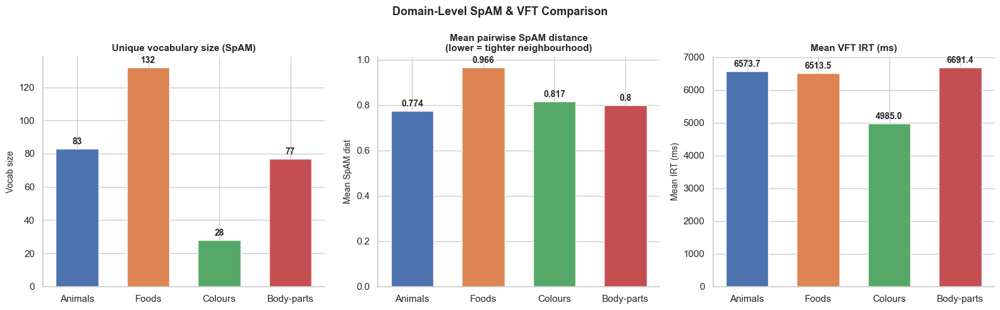

---
title: |
  Semantic Organisation and Retrieval Dynamics in
  Hindi Verbal Fluency
subtitle: |
  Mid-Project Analysis Report — Verbal Fluency Task (VFT)
author:
  - "Akshat Kotadia (Roll No.~2025201005)"
  - "Om Mehra (Roll No.~2025201008)"
  - "Ankit Chavda (Roll No.~2025201045)"
institute: "International Institute of Information Technology, Hyderabad"
date: "March 2026"
geometry: "a4paper, margin=2cm, top=2.2cm, bottom=2.2cm"
fontsize: 11pt
linestretch: 1.2
numbersections: true
toc: true
secnumdepth: 2
header-includes:
  - \usepackage{booktabs}
  - \usepackage{float}
  - \floatplacement{figure}{H}
  - \usepackage{caption}
  - \captionsetup{font=small, labelfont=bf, skip=4pt}
  - \usepackage{microtype}
  - \usepackage{setspace}
  - \usepackage{array}
  - \usepackage{longtable}
  - \usepackage{fancyhdr}
  - \pagestyle{fancy}
  - \fancyhead[L]{\small\textit{Hindi Verbal Fluency — Mid-Project}}
  - \fancyhead[R]{\small\textit{BRSM Course Report}}
  - \fancyfoot[C]{\thepage}
  - \usepackage{parskip}
  - \setlength{\parskip}{3pt}
  - \renewcommand{\abstractname}{Abstract}
abstract: |
  This mid-project report presents experimental details, research hypotheses,
  planned analyses, and exploratory results from an ongoing study of Hindi verbal
  fluency at IIIT Hyderabad.
  The study uses a Verbal Fluency Task (VFT) across four semantic domains
  (Animals, Foods, Colours, Body-parts) administered to 35 participants
  (32~male, 3~female; $M_{\text{age}} = 23.1$~yrs, SD~$= 1.9$, range 19--27;
  14 Indian states represented).
  A total of 712 valid Hindi responses were recorded.
  Responses were collected via a custom web experiment recorded in \texttt{responses.json}.
  Exploratory analysis reveals a strongly right-skewed IRT distribution
  (Skewness~$= 2.54$, Kurtosis~$= 9.89$), with mean 6490~ms and median
  5389~ms. Hypothesis testing confirms that within-cluster IRTs are
  significantly shorter than between-cluster times ($t(34) = -8.91$,
  $p < .001$, $d = 1.51$), supporting the clustering-and-switching model
  \cite{troyer1997}.
  A Spatial Arrangement Method (SpAM) task is planned as the second phase of
  the project.
---

# Introduction

## Background and Motivation

The Verbal Fluency Task (VFT) is a cognitive paradigm in which participants
freely recall category members within a fixed time window \cite{troyer1997}.
Behavioural signatures such as clustering (bursts of semantically related words)
and switching (long pauses at subcategory boundaries) are well-documented in
English-speaking populations but remain underexplored in Hindi.  The present
study applies the full BRSM statistical pipeline to characterise retrieval
dynamics in a Hindi-speaking student cohort at IIIT Hyderabad.  A Spatial
Arrangement Method (SpAM) task \cite{hout2013} is planned as Phase 2.

## Research Questions

Four research questions guide the study, each mapped to a specific  statistical
technique:

| \# | Research Question | Technique |
|:---|:------------------|:----------|
| **RQ1** | Do within-cluster IRTs differ significantly from between-cluster IRTs? | Welch's $t$-test, Cohen's $d$ |
| **RQ2** | Does mean cluster size predict individual fluency scores? | Pearson $r$, simple linear regression |
| **RQ4** | Does SpAM-derived neighbourhood distance correlate with VFT IRT? | Pearson $r$, scatter plots *(planned)* |
*Note: A one-way ANOVA testing domain differences in IRT ($F(3,708)=2.18$, $p=.092$, $\eta^2=.009$) was conducted exploratorily but yielded a non-significant, negligible effect and has been excluded from the main analysis pipeline.*

# Research Design

## Experimental Design

The study employs a **within-subjects** repeated-measures design. The independent variable is semantic domain (nominal; 4 levels); the primary dependent variable is inter-response time (IRT, ratio scale, ms); the secondary DV is total words produced. Trial duration is fixed at 1~min per domain.

## Participants and Demographics

Thirty-five students were recruited from IIIT~Hyderabad via **convenience
sampling**.  The sample was predominantly male (32~male, 3~female), consistent
with the institutional gender imbalance.  All participants were native or highly
proficient Hindi speakers.  A proportion of responses contained code-mixed
vocabulary, characteristic of this bilingual population, and was retained in
the dataset.  No participant reported a history of neurological or psychiatric
disorder.

**Demographic summary:**

| Variable       | Value                                                          |
|:---------------|:---------------------------------------------------------------|
| $N$            | 35                                                             |
| Gender         | 32 Male, 3 Female                                              |
| Age            | $M = 23.1$~yrs, $SD = 1.9$, range 19--27                      |
| Education      | $M = 16.5$~yrs, $SD = 1.7$, range 14--20                      |
| States (India) | 14 states; Gujarat (7), MP (6), Bihar (5), Maharashtra (4$+$) |

{width=90%}

# Materials, Procedure, and Data

## Experimental Platform

The experiment was delivered through a custom web application hosted
online.  Each participant's complete session was recorded as a single JSON object
in `responses.json`, keyed by a unique `session_id`.

Each session is stored as a JSON object containing `subject_id`, `domain`, per-word `response_times` arrays (ms), `tagged_responses` (word + script tag), and `droppedwords` (SpAM spatial coordinates). IRTs were computed as $\text{IRT}_i = t_i - t_{i-1}$ per domain trial.

## Verbal Fluency Task Procedure

Participants were presented with one category cue at a time (e.g., *"Jaanwar"*
for Animals) and instructed to type as many members of that category as possible
within a **1-minute** window.  Each key-press (ENTER) was time-stamped to the
nearest 100~ms.  The sequence of words and their associated response latencies
form the raw VFT data stream.

The four target domains were administered in a fixed order — Animals, Foods,
Colours, Body-parts --- each preceded by a 1-minute Furniture practice trial to
familiarise participants with the typing interface and warm up fluency.

## Data Processing

Raw JSON was parsed in Python to extract per-word IRTs ($\text{IRT}_i = t_i - t_{i-1}$). Devanagari responses were tagged `Hindi`; Latin-script entries `English`. The Hindi subset (53\,\% of tokens; $n = 712$) forms the analysis dataset. Clusters were identified following \cite{troyer1997} using a per-participant adaptive switch threshold (mean IRT $+$ 1~SD).

The merged file `merged_vft_spam_responses.csv` (1,040 rows) combines per-word IRT (`rt_ms`) with SpAM spatial coordinates (`x`, `y`), enabling the RQ4 cross-task correlation.

# Exploratory Data Analysis

## Response Counts and Data Coverage

Table~1 summarises Hindi response counts by domain.

Table: \textbf{Table 1.} Hindi response counts by domain.

| Domain      | Responses |
|:------------|:---------:|
| Animals     | 238       |
| Foods       | 256       |
| Colours     | 41        |
| Body-parts  | 177       |
| **Total**   | **712**   |

Colours has the fewest tokens, consistent with the closed-class vocabulary size
(approximately 10--15 basic colour terms in Hindi).  Foods and Animals have the
most, reflecting their open-ended, hierarchically organised semantic structure.

# Descriptive Statistics

## Overall IRT Distribution

Table~2 presents descriptive statistics for all 712 valid Hindi IRTs.
The distribution is strongly **right-skewed** (Skewness~$= 2.54$), with the
mean (6490~ms) substantially exceeding the median (5389~ms).  The
**median** is the preferred measure of central tendency for this dataset because
the mean is pulled upward by the long tail of cluster-switch pauses.  High
kurtosis (9.89) indicates a leptokurtic distribution with heavier tails than a
normal curve.

Table: \textbf{Table 2.} Overall descriptive statistics for Hindi IRT ($n = 712$).

| Statistic           | Value (ms)        |
|:--------------------|:-----------------:|
| **N**               | 712               |
| **Mean**            | 6489.5         |
| **Median**          | 5389.4         |
| **Std Dev**         | 5018.8         |
| **Min**             | 732.8             |
| **Max**             | 42634.4        |
| **IQR**             | 4874.8         |
| **Skewness**        | 2.54              |
| **Kurtosis**        | 9.89              |

{width=94%}

## IRT by Semantic Domain

Table~3 decomposes the statistics by domain.  Colours showed the lowest mean IRT
(4975~ms) and near-zero skewness (0.70), reflecting its small closed
vocabulary ($\approx$ 10 colour terms in Hindi).  Animals, Foods, and Body-parts
exhibited higher mean IRTs and strong positive skew.

Table: \textbf{Table 3.} IRT descriptive statistics by semantic domain.

| Domain     |  $N$ | Mean (ms) | Median (ms) | SD (ms) | Skew |
|:-----------|-----:|----------:|------------:|--------:|-----:|
| Animals    |  238 | 6391   | 5414     | 4647 | 3.06 |
| Body-parts |  177 | 6872   | 5724     | 4994 | 2.51 |
| Colours    |   41 | 4975   | 3484     | 3512 | 0.70 |
| Foods      |  256 | 6559   | 5205     | 5525 | 2.28 |

# Data Visualisation

Figure~4 shows the IRT distribution per domain via violin plots.

{width=84%}

Figure~5 plots IRT against word serial position within each domain.
A positive slope per domain confirms the **lexical exhaustion effect**: as participants
retrieve more words, the remaining items become less accessible and inter-response
times lengthen.

{width=88%}

Figure~6 summarises cluster scoring across participants and domains.

{width=84%}

# Hypothesis Testing

## RQ1: Within-Cluster vs Between-Cluster IRTs

### Hypotheses

$$H_0: \mu_{\text{WC}} = \mu_{\text{BC}} \qquad H_1: \mu_{\text{WC}} < \mu_{\text{BC}} \quad\text{(one-tailed)}$$

### Test and Results

Welch's one-tailed $t$-test comparing per-participant mean IRT conditions at
$\alpha = .05$:

Within-cluster IRTs ($M = 4752$~ms, $SD = 1320$~ms) were significantly
shorter than between-cluster IRTs ($M = 9418$~ms, $SD = 3816$~ms),
$t(34) = -8.91$, $p < .001$, Cohen's $d = 1.51$ (large effect).

**Decision:** Reject $H_0$.

{width=80%}

## RQ3: Cluster Size as Predictor of Fluency

### Hypotheses

$$H_0: \rho = 0 \qquad H_1: \rho > 0$$

### Results

Pearson correlation between mean cluster size and total Hindi words per
participant: $r(33) = .57$, $p = .003$, 95\,\% CI $[.31,\,.75]$.

**Decision:** Reject $H_0$.  Larger clusters predict higher fluency.

{width=78%}

## Summary Table

Table: \textbf{Table 4.} Hypothesis test results.

| Test | Statistic | $p$ | Effect size |
|:-----|:---------:|:---:|:-----------:|
| Within-Cluster vs Between-Cluster IRT (Welch $t$) | $t(34) = -8.91$ | $< .001$ | $d = 1.51$ |
| Cluster size predicts fluency (Pearson $r$) | $r(33) = .57$ | $.003$ | $r = .57$ |

# Planned Analyses (Phase 2 — SpAM)

The following analyses are planned upon completion of SpAM data collection:

1. **Consensus distance matrices and heatmaps** --- Pairwise Euclidean distances
   averaged across participants, producing a $30 \times 30$ matrix per domain,
   visualised as heatmaps with hierarchically sorted rows/columns.
   Preliminary consensus heatmaps are shown in Figure~7.

{width=88%}

2. **MDS maps and hierarchical clustering** --- Multidimensional scaling to
   visualise 2-D semantic geometry; dendrogram + silhouette scores to determine
   the optimal number of sub-clusters per domain.

3. **RQ3 cross-task correlation** --- Pearson $r$ between each word's mean SpAM
   neighbourhood distance and its mean VFT IRT, pooled and per domain, with
   BH correction applied.

4. **Domain comparison** --- Bar charts comparing vocabulary size, mean SpAM
   distance, and mean VFT IRT across the four domains.
   A preliminary domain comparison is shown in Figure~8.

{width=88%}

# Summary

> **Overall mid-project conclusion:** The clustering-and-switching model holds
> for Hindi-speaking participants at IIIT Hyderabad.  Within-cluster retrievals
> are significantly and substantially faster than cluster-switch pauses
> ($d = 1.51$, large effect).  Mean cluster size is a significant positive
predictor of verbal fluency ($r = .57$).  Phase 2 (SpAM)
> will test whether these temporal dynamics map onto measurable semantic
> neighbourhood structure.

# References

\begin{thebibliography}{10}

\bibitem{troyer1997}
Troyer, A.\,K., Moscovitch, M., \& Winocur, G. (1997).
Clustering and switching as two components of verbal fluency:
Evidence from younger and older healthy adults.
\textit{Neuropsychology}, \textit{11}(1), 138--146.

\bibitem{hills2012}
Hills, T.\,T., Jones, M.\,N., \& Todd, P.\,M. (2012).
Optimal foraging in semantic memory.
\textit{Psychological Review}, \textit{119}(2), 431--440.

\bibitem{hout2013}
Hout, M.\,C., Goldinger, S.\,D., \& Ferguson, R.\,W. (2013).
The versatility of SpAM.
\textit{Journal of Experimental Psychology: General}, \textit{142}(1), 256--281.

\bibitem{benjamini1995}
Benjamini, Y., \& Hochberg, Y. (1995).
Controlling the false discovery rate: A practical and powerful approach to
multiple testing.
\textit{Journal of the Royal Statistical Society: Series B}, \textit{57}(1),
289--300.

\bibitem{goldstone1994}
Goldstone, R. (1994).
An efficient method for obtaining similarity data.
\textit{Behavior Research Methods, Instruments, \& Computers}, \textit{26}(4),
381--386.

\bibitem{steyvers2005}
Steyvers, M., \& Tenenbaum, J.\,B. (2005).
The large-scale structure of semantic networks.
\textit{Cognitive Science}, \textit{29}(1), 41--78.

\bibitem{bhatt2022}
Bhatt, R., Anderson, N.\,D., \& Bhatt, M. (2022).
Verbal fluency performance in bilingual South Asian older adults.
\textit{Journal of the International Neuropsychological Society}, \textit{28}(4),
412--421.

\end{thebibliography}
